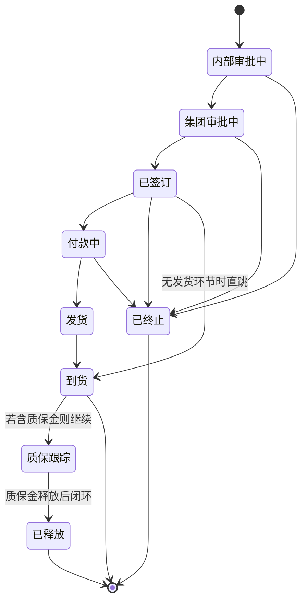

# 02. 系统设计（概要设计 V1.0）

> 对应 `01-requirements.md`（V1.0 冻结）的技术方案。架构满足：纯内网、3~4 人、单服务器、可演进。
> V0.9→V0.95：按决策移除登录/角色/权限相关设计（认证、USER 表、AUDIT_LOG、权限列），
> 变更历史不再记录操作人，合同以"经办人"字段承担责任人。

## 1. 总体架构

采用**单体 Web 应用**（Monolith），前后端可分离开发、同机部署：

```
┌────────────── 浏览器（内网 Chrome/Edge，无需登录）────┐
│            Vue3 + Element Plus 单页应用                 │
└───────────────────────┬──────────────────────────────┘
                        │ HTTP + JSON API
┌───────────────────────▼──────────────────────────────┐
│                  反向代理 Nginx                        │
│        （静态资源 + /api 转发 + 上传大小限制）          │
└───────────────────────┬──────────────────────────────┘
        ┌───────────────▼────────────────┐
        │  后端应用服务（Python FastAPI） │
        │  · 业务 API（合同/标签/附件…）   │
        │  · Excel 导出(openpyxl)         │
        │  · 变更历史写入、系统日志        │
        └───────────────┬────────────────┘
        ┌───────────────▼────────────────┐
        │  关系数据库                     │
        │  原型: SQLite → 正式: PostgreSQL│
        └────────────────────────────────┘
        ┌───────────────▼────────────────┐
        │  附件存储目录（本地磁盘卷）      │
        │  <app>/uploads/<合同ID>/...     │
        └────────────────────────────────┘
```

- **无认证层**：系统只监听内网地址，任何人可访问；不做登录/角色/JWT（决策见 `01` §2）；
- 单体内按模块分包（contract / tag / attachment / report / log），便于未来演进；
- 数据访问层用 ORM（SQLAlchemy）做数据库抽象，SQLite → PostgreSQL 切换只改连接串与少量迁移；
- 到期提醒在打开首页时实时计算即可，无需后台定时任务。

## 2. 技术选型摘要（详细论证见 `04-tech-route.md`）

| 层 | 选型 | 理由 |
|---|---|---|
| 后端 | Python 3.11 + FastAPI + SQLAlchemy + Pydantic | 上手快、类型安全、自带 OpenAPI 文档、生态成熟 |
| 前端 | Vue 3 + Vite + Element Plus + Pinia + Vue Router | 后台管理型 UI 组件全、中文生态好、内网静态部署简单 |
| 数据库 | 原型 SQLite → 正式 PostgreSQL 16 | 3~4 人 SQLite 足够零运维；ORM 保证平滑升级 |
| 导出 | 后端 openpyxl 生成 .xlsx | 服务端导出行数可控 |
| 部署 | Linux + Docker Compose（备选 Windows 原生，见 04） | 备份/升级/迁移简单 |
| 备份 | cron + pg_dump/SQLite .backup + 附件目录同步 | 每日全量 |

## 3. 数据模型（ER）

```mermaid
erDiagram
    CONTRACT {
        int id PK
        string contract_no UK "合同编号"
        string name
        string type "采购/销售/其他"
        string party_a "甲方"
        string party_b "乙方"
        date sign_date
        date effective_date "可空"
        string subject_matter "标的物"
        decimal amount "合同金额"
        string currency "CNY默认"
        decimal paid_amount "累计已付"
        bool has_warranty
        decimal warranty_amount "质保金金额"
        decimal warranty_rate "质保金比例"
        date warranty_start "质保生效"
        int warranty_months "质保期限(月)"
        date warranty_end "计算/手填 到期"
        bool warranty_released
        date warranty_release_date
        string warranty_note
        bool is_framework "是否框架合同"
        int parent_id FK "所属框架合同->CONTRACT.id(空=独立)"
        string arrival_status "未到货/部分/已到货"
        date expected_arrival_date
        string status "状态机当前值"
        string owner_name "经办人(自由文本)"
        string remark
        bool deleted "软删除"
        datetime created_at
        datetime updated_at
    }
    TAG {
        int id PK
        string name UK
        string color "展示色"
        bool builtin
        datetime created_at
    }
    CONTRACT ||--o{ CONTRACT_TAG : ""
    TAG ||--o{ CONTRACT_TAG : ""
    CONTRACT_TAG {
        int contract_id FK
        int tag_id FK
        PK(contract_id, tag_id)
    }
    CONTRACT ||--o{ ATTACHMENT : "1..n"
    ATTACHMENT {
        int id PK
        int contract_id FK
        string file_name
        string stored_path
        string content_type
        int size_bytes
        datetime uploaded_at
        bool deleted
    }
    CONTRACT ||--o{ CHANGE_LOG : ""
    CHANGE_LOG {
        int id PK
        int contract_id FK
        string field_name
        string old_value
        string new_value
        string note "备注/原因"
        string source "manual/auto"
        datetime created_at
    }
```

设计说明（相对旧版变更）：

- **无 USER 表、无登录态、无 AUDIT_LOG**：`CONTRACT.owner_name` 为自由文本经办人（责任标记）；
- 框架合同为 `CONTRACT` 自引用（`parent_id`），天然一对多；
- 合同软删除后保留 30 天可恢复（Q7/AC-15），过期由维护脚本清理；附件删除同策略；
- 变更历史 `CHANGE_LOG` 覆盖：状态、金额、已付、质保字段、绑定关系、软删除/恢复；**不含操作人**，仅时间与前后值，`source` 标记"自动换算"等来源；
- 附件存储磁盘、元数据入库，软删除 + 定时清理（正式版）；
- 标签独立字典 + 关联表；改名即更新字典。

## 4. 状态机（进度状态）



- **允许任意状态间手动跳转**（含回退），跳转必写历史——图中箭头只是推荐正向路径；
- 状态集合来自字典，可增删；核心状态（已签订/已终止/到货/已释放）与看板/导出联动。

## 5. 页面与路由设计

| 路由 | 页面 | 要点 |
|---|---|---|
| `/` | 首页看板 | 统计卡（合同总数/履约中/质保即将到期/已到期）+ 提醒表 + 快捷入口 |
| `/contracts` | 合同列表 | 组合搜索区（关键词/标签多选/类型/状态/经办人/日期区间）+ 表格 + 分页 + 导出 + 快捷筛（即将质保到期/已到期） |
| `/contracts/new` `/contracts/:id/edit` | 合同表单 | 分节：基本信息/付款与质保/标签选择/框架绑定/附件/经办人 |
| `/contracts/:id` | 合同详情 | 主字段卡 + 标签 + 框架关联区 + 附件区 + 变更历史时间线 |
| `/tags` | 标签字典 | 列表/新增/改名/删除（无角色限制，全员可维护） |
| `/logs`（可选） | 变更日志 | 全局按时间/合同筛选，用于巡检 |

关键交互（低保真示意）——合同列表页：

```
┌──────────────────────────────────────────────────────┐
│ 搜索: [合同名/编号/甲乙关键词]  [甲方▾] [乙方▾]        │
│ 标签: [采购×][项目B×] +添加标签  类型:[全部▾]          │
│ 状态:[全部▾]  经办人:[__] 签订日期:[2025-01-01]~[2025-12-31]│
│ ✔即将质保到期  ✔质保已到期          [查询][重置]        │
├──────────────────────────────────────────────────────┤
│ 结果: 共 N 条                    [导出Excel] [新增合同] │
│ 编号 | 名称 | 甲/乙方 | 金额 | 已付 | 比例 | 状态 | 签订日│
│ ...                                                    │
└──────────────────────────────────────────────────────┘
```

## 6. 后端 API 草案（REST，无认证）

| 方法 | 路径 | 说明 |
|---|---|---|
| GET | /api/contracts | 分页+筛选查询 |
| POST | /api/contracts | 新增 |
| GET/PUT/DELETE | /api/contracts/{id} | 详情 / 修改 / 软删除(填原因) |
| PUT | /api/contracts/{id}/restore | 恢复停用合同（30 天内，Q7/AC-15） |
| POST/DELETE | /api/contracts/{id}/tags/{tag_id} | 挂/摘标签 |
| PUT | /api/contracts/{id}/status | 状态流转（含备注） |
| PUT | /api/contracts/{id}/bind | 设置 parent 框架 / 解绑 |
| GET | /api/contracts/{id}/logs | 变更历史 |
| GET/POST/DELETE | /api/contracts/{id}/attachments | 附件列表 / 上传 / 删除(填原因) |
| GET | /api/attachments/{id}/download | 下载/预览 |
| GET | /api/tags | 标签字典 |
| POST/PUT/DELETE | /api/tags | 标签新增/改名/删除 |
| GET | /api/export/contracts.xlsx?<筛选条件> | 导出当前结果 |
| GET | /api/dashboard | 看板统计与提醒 |

- 无认证依赖，纯内网访问；上传大小限制在 Nginx（默认 20MB/文件）；
- 所有写接口返回变更摘要并写入 `CHANGE_LOG`；字典类维护写系统日志。

## 7. 访问控制与安全说明

- **无登录、无角色**（决策）：系统仅对内网开放，由部署层（防火墙/网段）+ 内网信任承担边界；
- 代价与对策已写入 `01` §2：不可按人审计 → 经办人字段 + 变更历史（时间/前后值）+ 每日备份；
- 后端仍做**统一参数校验 + ORM 防注入 + 上传类型白名单 + 随机文件名**，防止低级安全问题；
- 若未来需要操作审计：演进为"请求记录访问者身份（简单口令或按电脑名登记）→ 恢复 `CHANGE_LOG.user` 外键"，接口层无需大改。

## 8. 到期提醒实现

- 不引入定时任务与推送：`/api/dashboard` 每次实时查询：
  `warranty_end <= today+30 AND warranty_end >= today AND NOT released` → 即将到期；
  `warranty_end < today AND NOT released` → 已到期；
- 看板红黄标识；点击跳转该合同详情。
- 正式版如需邮件通知，只需加一个"每日扫描 + SMTP 发送"任务，接口不变。

## 9. Excel 导出设计

- 后端按当前筛选参数重新查询（与服务端分页一致，避免只导当前页）；
- openpyxl 生成 .xlsx，UTF-8，中文表头；列集合 = 列表核心列 + 经办人 + 标签（逗号合并）+ 质保列；
- 文件名带日期，如 `合同台账_2025-06-01.xlsx`。

## 10. 日志、备份与恢复

| 项 | 方案 |
|---|---|
| 应用日志 | 按天滚动文件日志（access/error/app） |
| 行为留痕 | CHANGE_LOG（合同级）+ 系统操作日志（标签字典等维护） |
| 数据库备份 | 每日凌晨全量备份，保留 30 天 |
| 附件备份 | 附件目录每日增量同步到备份盘 |
| 恢复演练 | 上线后每季度执行一次恢复演练并记录 |

## 11. 测试策略

- 原型阶段：P0 验收场景手动冒烟清单（对应 `01` AC-01~AC-11）+ 接口冒烟脚本；
- 正式阶段：pytest 覆盖核心业务规则（BR3 比例计算、BR5 到期换算、BR8 组合筛选、BR2 编号唯一），再叠加 pytest-bdd 承接 AC；
- 前端：核心流程 e2e 冒烟（可选 Playwright）。
- 说明：无认证，故不存在 403/越权测试用例。

## 12. 演进路线（对应未来增强）

1. 付款逐笔记录（新表 PAYMENT + 汇总视图，字段兼容现 `paid_amount`）；
2. 常用单位字典（甲方乙方下拉复用）；
3. 附件 OCR 与正文检索（引入内网 OCR 服务或评估方案）；
4. 标签分级/分类（项目、类型两级）；
5. 邮件通知（加定时扫描任务）；
6. 审批流（如需，评估在状态机上加"待办人"字段或引入轻量流程）；
7. 审计需求出现时引入账号与登录（见 §7，接口层无需大改）。
