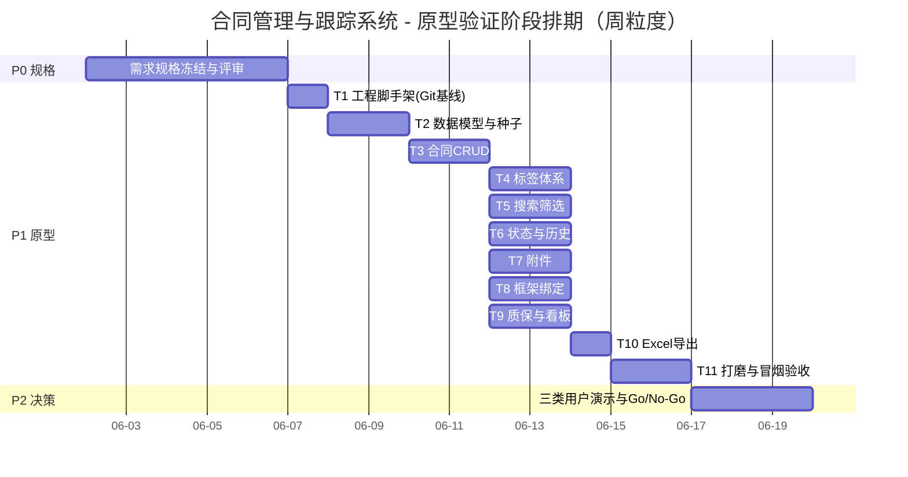

# 03. 开发计划（SDD 规格驱动，原型优先）

> 基准假设：**1 名全栈开发者**按规格推进；若后期两人并行，见 5 节并行切分。
> 周期以"人日"计，每周按 5 人日折算。
> V0.9→V0.95：按决策取消认证/角色相关任务（原 T3），加入 **Git 版本纪律**（§3.1）。

## 1. 总体策略

先"规格冻结 → 原型验证（P0 闭环）→ 决策 → 正式版"，避免一上来做全套导致返工：

```
Phase 0 规格冻结(本文档01评审)   → Go 进入原型
Phase 1 原型MVP(P0场景全绿)      → 三类用户演示 → Go/No-Go 决策
Phase 2 (Go) 正式版 M0/M1        → UAT → 上线 → 迭代 M2+
```

配合两条工作纪律（贯穿全部阶段）：

1. **SDD 小循环**：每功能 = 规格核对 → 实现 → 跑验收场景 → 场景全绿才算完成；
2. **Git 版本纪律**：每完成一个功能（对应 AC 全绿）即 **commit 一次**，规格文档变更同步提交。

## 2. 阶段与里程碑

| 阶段 | 周期(单人) | 里程碑 | 出口标准(DoD) |
|---|---|---|---|
| P0 需求规格冻结 | ~~0.5~1 周~~ **已完成** | M0：`01` **V1.0 冻结**（Q1~Q8 按默认值确认） | 已满足：口径全部收敛，可进入 P1 |
| P1 原型验证 MVP | ~~3~4 周~~ **已完成** | M1：可演示原型 | **AC-01~AC-11 全绿（12 项检查）+ 每功能均有对应 Git commit**（见 `05-prototype-acceptance.md`） |
| P2 决策与计划调整 | 0.5~1 周（**待进行**） | M2：Go/No-Go | 决策记录归档；正式版范围/排期更新 |
| P3 正式版 M0（若 Go） | 2~3 周 | M3：v1.0 内测版 | 数据库切 PostgreSQL、备份上线、BR 单测覆盖 |
| P4 UAT 与上线 | 0.5~1 周 | M4：正式上线 | 三类用户 UAT 通过、使用培训完成、运维手册交付 |
| P5 迭代 M1/M2 | 每轮 1~2 周 | M5+ | 按需求变更流程（先改规格再实现） |

总预算参考：**原型 ~3.5~4.5 周**；若要直接做正式版再加 **~4~6 周**（单人）。

> **P0 已完成**（需求规格 V1.0 冻结）；**P1 原型 MVP 已完成并通过验收**（见 `05-prototype-acceptance.md`），当前处于 **P2 决策**（三类用户演示）。

## 3. 原型（P1）任务分解（WBS）

### 3.1 Git 版本纪律（工作约定）

- 仓库初始化：P1 开始（T1）即建 Git 仓库，`docs/` 与 `app/`、`web/` 同库管理；
- **一个功能 = 一个 commit**：当某功能（见下 T2~T11 各自的 AC 集合）跑通验收场景后立即 commit；
- 提交信息格式建议：`feat: [AC-xx] 功能名`，或对规格/计划文档用 `docs: ...`；
- 每功能先更新规格再实现；规格改动与实现改动允许同一 commit（小步快走），但 commit 说明中注明；
- 禁止把"未验证的功能"带入 commit；每日结束时至少一次 commit，防止工作丢失。

### 3.2 任务表

| 任务 | 内容 | 验收（对应 AC） | 依赖 | 估时 |
|---|---|---|---|---|
| T1 工程脚手架 | 前端/后端工程、Git 仓库初始化、README 约定、首个基线 commit | 工程可启动 | P0 冻结 | 1d |
| T2 数据模型 | ER 落库、迁移脚本、种子字典（状态集/预置标签/演示数据）；无 USER 表 | 建表成功 | T1 | 1~1.5d |
| T3 合同 CRUD | 新增/编辑/详情/停用与恢复、编号唯一校验（BR1/BR2/BR10）、经办人字段 | AC-01/02/10/15 | T2 | 2d |
| T4 标签体系 | 标签字典、合同挂/摘标签、预置标签 | AC-05/13 | T3 | 1~1.5d |
| T5 搜索筛选 | 组合筛选（BR8）、分页、排序、快捷筛（质保）、经办人筛选 | AC-06 | T3/T4 | 2d |
| T6 状态与历史 | 状态机、手动流转、CHANGE_LOG 时间线（无操作人） | AC-04/12 | T3 | 1.5d |
| T7 附件 | 上传/预览/下载/删除留痕（BR11） | AC-09 | T3 | 1.5d |
| T8 框架绑定 | parent 绑定/解绑、框架详情子合同汇总 | AC-07 | T3 | 1.5d |
| T9 质保与看板 | 质保字段与到期换算（BR5）、首页看板预警 | AC-08/14 | T3/T6 | 1.5d |
| T10 Excel 导出 | 按当前筛选结果导出 .xlsx（BR8） | AC-11 | T5 | 1d |
| T11 打磨与冒烟 | 全 P0 场景总冒烟、演示脚本、打包与部署说明、最终 commit | AC-01~AC-11 | T3~T10 | 1.5d |

原型合计约 **16.5~19 人日**（含缓冲 ≈ 4 周单人）。每行完成后立即 Git commit，commit 记录即进度证据。

## 4. 进度示意（甘特）



> 每个任务的"验收 → commit"步骤隐含在任务末尾；T4/T5 有先后，T6~T9 在 T3 完成后可并行推进，
> 并行时由各自负责人分别 commit（避免互相阻塞）。

## 5. 并行切分建议（若投入 2 人）

- 开发者 A：T1、T2、T3、T4、T5、T10（数据 → 合同 → 标签 → 搜索 → 导出）；
- 开发者 B：T6、T7、T8、T9（状态历史、附件、绑定、质保看板）+ T11 配合总冒烟；
- 前后端以 `02-system-design.md` 第 6 节 API 草案为准，同时开发（FastAPI 自动生成 OpenAPI，前端可 mock）；
- 双方各自按"功能完成即 commit"，冲突通过每日一次合并 + 小步提交控制。

## 6. 正式版（P3/P4，若 Go）范围建议

- M0 必备：PostgreSQL 切换、每日备份/恢复脚本、部署文档（Linux Docker / Windows 两版）、
  BR 自动化单测（BR2/3/5/8）、日志轮转；
- M1 候选：常用单位字典、标签分类、经办人常用值联想、全局变更日志页；
- 明确不做：登录/角色/权限、审批流、OCR、消息推送（见 `01` 第 6 节）。

## 7. 风险登记册

| # | 风险 | 概率/影响 | 应对 |
|---|---|---|---|
| R1 | 业务口径不统一（付款比例、质保算法）导致返工 | 高/高 | P0 规格评审强制收敛 Q1~Q8；原型期早演示 |
| R2 | 内网服务器未定（Win/Linux） | 高/中 | 04 提供两套部署；技术选型与 OS 解耦（跨平台 Python/前端静态） |
| R3 | 用户时间不足、演示流于形式 | 中/中 | 每类用户 1 次 30 分钟演示 + 真实合同试录 |
| R4 | 附件/数据丢失（无备份习惯） | 低/高 | P3 强制备份方案；原型期每日本地备份演示 |
| R5 | 单人开发延期 | 中/中 | P1 只做 P0 场景；范围外一律记 backlog |
| R6 | 原型验证通过后方向变更（如又要求登录/审计） | 低/中 | 变更走规格流程；演进路线已预留（02 §12 第 7 条），改造可控 |
| R7 | 导出口径与页面显示不一致 | 中/低 | 导出复用同一查询函数（单一数据源） |
| R8 | 功能完成未及时 commit，版本纪律失效 | 中/低 | DoD 强制"AC 全绿 + commit"双条件；每日收工必须 commit |

## 8. 变更登记表

| 日期 | 变更内容 | 影响范围(BR/AC/文件) | 状态 |
|---|---|---|---|
| 2025-06 | 取消登录与角色；Git 版本纪律（每功能一 commit） | BR9/BR12、AC-10、02 全文、03 §3.1、04 相关节 | 已并入 V0.95 |
| 2025-06 | Q1~Q8 按默认值确认，需求规格冻结 V1.0；新增 AC-15（停用与恢复） | 01 §4/§9、README、03 §2/T3 | 已完成 |
| （待填） | 需求变更按 `00-sdd-process.md` 4.3 流程登记 | — | — |
