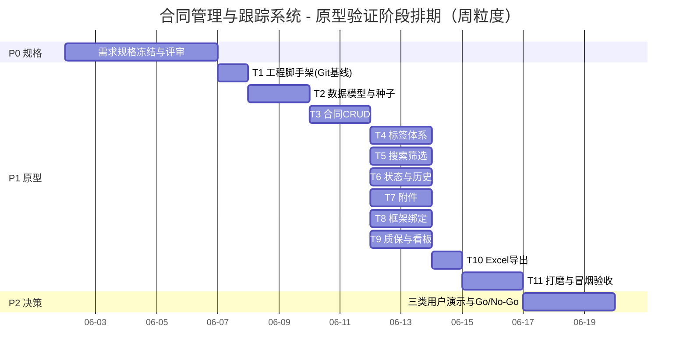

# 03. 开发计划（SDD 规格驱动，原型优先）

> 基准假设：**1 名全栈开发者**按规格推进；若后期两人并行，见 5 节并行切分。
> 周期以"人日"计，每周按 5 人日折算。
> V0.9→V0.95：按决策取消认证/角色相关任务（原 T3），加入 **Git 版本纪律**（§3.1）。
> **V2.0（ERP 进销存）：V1.0 交付回顾与 V2.0 任务分解见第 9 节起**（`11-erp-requirements.md` + `12-erp-system-design.md`）。

## 1. 总体策略

先"规格冻结 → 原型验证（P0 闭环）→ 决策 → 正式版"，避免一上来做全套导致返工：

```
Phase 0 规格冻结(本文档01评审)   → Go 进入原型
Phase 1 原型MVP(P0场景全绿)      → 三类用户演示 → Go/No-Go 决策
Phase 2 (Go) 正式版 M0/M1        → UAT → 上线 → 迭代 M2+
```

配合两条工作纪律（贯穿全部阶段）：

1. **SDD 小循环**：每功能 = 规格核对 → 实现 → 跑验收场景 → 场景全绿才算完成；
2. **Git 版本纪律**：每完成一个功能（对应 AC 全绿）即 **commit 一次**，规格文档变更同步提交。

## 2. 阶段与里程碑

| 阶段 | 周期(单人) | 里程碑 | 出口标准(DoD) |
|---|---|---|---|
| P0 需求规格冻结 | ~~0.5~1 周~~ **已完成** | M0：`01` **V1.0 冻结**（Q1~Q8 按默认值确认） | 已满足：口径全部收敛，可进入 P1 |
| P1 原型验证 MVP | ~~3~4 周~~ **已完成** | M1：可演示原型 | **AC-01~AC-11 全绿（12 项检查）+ 每功能均有对应 Git commit**（见 `05-prototype-acceptance.md`） |
| P2 决策与计划调整 | 0.5~1 周（**待进行**） | M2：Go/No-Go | 决策记录归档；正式版范围/排期更新 |
| P3 正式版 M0（若 Go） | 2~3 周 | M3：v1.0 内测版 | 数据库切 PostgreSQL、备份上线、BR 单测覆盖 |
| P4 UAT 与上线 | 0.5~1 周 | M4：正式上线 | 三类用户 UAT 通过、使用培训完成、运维手册交付 |
| P5 迭代 M1/M2 | 每轮 1~2 周 | M5+ | 按需求变更流程（先改规格再实现） |

总预算参考：**原型 ~3.5~4.5 周**；若要直接做正式版再加 **~4~6 周**（单人）。

> **P0 已完成**（需求规格 V1.0 冻结）；**P1 原型 MVP 已完成并通过验收**（见 `05-prototype-acceptance.md`），当前处于 **P2 决策**（三类用户演示）。

## 3. 原型（P1）任务分解（WBS）

### 3.1 Git 版本纪律（工作约定）

- 仓库初始化：P1 开始（T1）即建 Git 仓库，`docs/` 与 `app/`、`web/` 同库管理；
- **一个功能 = 一个 commit**：当某功能（见下 T2~T11 各自的 AC 集合）跑通验收场景后立即 commit；
- 提交信息格式建议：`feat: [AC-xx] 功能名`，或对规格/计划文档用 `docs: ...`；
- 每功能先更新规格再实现；规格改动与实现改动允许同一 commit（小步快走），但 commit 说明中注明；
- 禁止把"未验证的功能"带入 commit；每日结束时至少一次 commit，防止工作丢失。

### 3.2 任务表

| 任务 | 内容 | 验收（对应 AC） | 依赖 | 估时 |
|---|---|---|---|---|
| T1 工程脚手架 | 前端/后端工程、Git 仓库初始化、README 约定、首个基线 commit | 工程可启动 | P0 冻结 | 1d |
| T2 数据模型 | ER 落库、迁移脚本、种子字典（状态集/预置标签/演示数据）；无 USER 表 | 建表成功 | T1 | 1~1.5d |
| T3 合同 CRUD | 新增/编辑/详情/停用与恢复、编号唯一校验（BR1/BR2/BR10）、经办人字段 | AC-01/02/10/15 | T2 | 2d |
| T4 标签体系 | 标签字典、合同挂/摘标签、预置标签 | AC-05/13 | T3 | 1~1.5d |
| T5 搜索筛选 | 组合筛选（BR8）、分页、排序、快捷筛（质保）、经办人筛选 | AC-06 | T3/T4 | 2d |
| T6 状态与历史 | 状态机、手动流转、CHANGE_LOG 时间线（无操作人） | AC-04/12 | T3 | 1.5d |
| T7 附件 | 上传/预览/下载/删除留痕（BR11） | AC-09 | T3 | 1.5d |
| T8 框架绑定 | parent 绑定/解绑、框架详情子合同汇总 | AC-07 | T3 | 1.5d |
| T9 质保与看板 | 质保字段与到期换算（BR5）、首页看板预警 | AC-08/14 | T3/T6 | 1.5d |
| T10 Excel 导出 | 按当前筛选结果导出 .xlsx（BR8） | AC-11 | T5 | 1d |
| T11 打磨与冒烟 | 全 P0 场景总冒烟、演示脚本、打包与部署说明、最终 commit | AC-01~AC-11 | T3~T10 | 1.5d |

原型合计约 **16.5~19 人日**（含缓冲 ≈ 4 周单人）。每行完成后立即 Git commit，commit 记录即进度证据。

## 4. 进度示意（甘特）


```mermaid
gantt
    title 合同管理与跟踪系统 - 原型验证阶段排期（周粒度）
    dateFormat  YYYY-MM-DD
    axisFormat  %m-%d
    section P0 规格
    需求规格冻结与评审        :a1, 2025-06-02, 5d
    section P1 原型
    T1 工程脚手架(Git基线)    :t1, after a1, 1d
    T2 数据模型与种子         :t2, after t1, 2d
    T3 合同CRUD              :t3, after t2, 2d
    T4 标签体系              :t4, after t3, 2d
    T5 搜索筛选              :t5, after t3, 2d
    T6 状态与历史            :t6, after t3, 2d
    T7 附件                  :t7, after t3, 2d
    T8 框架绑定              :t8, after t3, 2d
    T9 质保与看板            :t9, after t3, 2d
    T10 Excel导出            :t10, after t5, 1d
    T11 打磨与冒烟验收        :t11, after t10, 2d
    section P2 决策
    三类用户演示与Go/No-Go     :d1, after t11, 3d
```

> 每个任务的"验收 → commit"步骤隐含在任务末尾；T4/T5 有先后，T6~T9 在 T3 完成后可并行推进，
> 并行时由各自负责人分别 commit（避免互相阻塞）。

## 5. 并行切分建议（若投入 2 人）

- 开发者 A：T1、T2、T3、T4、T5、T10（数据 → 合同 → 标签 → 搜索 → 导出）；
- 开发者 B：T6、T7、T8、T9（状态历史、附件、绑定、质保看板）+ T11 配合总冒烟；
- 前后端以 `02-system-design.md` 第 6 节 API 草案为准，同时开发（FastAPI 自动生成 OpenAPI，前端可 mock）；
- 双方各自按"功能完成即 commit"，冲突通过每日一次合并 + 小步提交控制。

## 6. 正式版（P3/P4，若 Go）范围建议

- M0 必备：PostgreSQL 切换、每日备份/恢复脚本、部署文档（Linux Docker / Windows 两版）、
  BR 自动化单测（BR2/3/5/8）、日志轮转；
- M1 候选：常用单位字典、标签分类、经办人常用值联想、全局变更日志页；
- 明确不做：登录/角色/权限、审批流、OCR、消息推送（见 `01` 第 6 节）。

## 7. 风险登记册

| # | 风险 | 概率/影响 | 应对 |
|---|---|---|---|
| R1 | 业务口径不统一（付款比例、质保算法）导致返工 | 高/高 | P0 规格评审强制收敛 Q1~Q8；原型期早演示 |
| R2 | 内网服务器未定（Win/Linux） | 高/中 | 04 提供两套部署；技术选型与 OS 解耦（跨平台 Python/前端静态） |
| R3 | 用户时间不足、演示流于形式 | 中/中 | 每类用户 1 次 30 分钟演示 + 真实合同试录 |
| R4 | 附件/数据丢失（无备份习惯） | 低/高 | P3 强制备份方案；原型期每日本地备份演示 |
| R5 | 单人开发延期 | 中/中 | P1 只做 P0 场景；范围外一律记 backlog |
| R6 | 原型验证通过后方向变更（如又要求登录/审计） | 低/中 | 变更走规格流程；演进路线已预留（02 §12 第 7 条），改造可控 |
| R7 | 导出口径与页面显示不一致 | 中/低 | 导出复用同一查询函数（单一数据源） |
| R8 | 功能完成未及时 commit，版本纪律失效 | 中/低 | DoD 强制"AC 全绿 + commit"双条件；每日收工必须 commit |

## 8. 变更登记表

| 日期 | 变更内容 | 影响范围(BR/AC/文件) | 状态 |
|---|---|---|---|
| 2025-06 | 取消登录与角色；Git 版本纪律（每功能一 commit） | BR9/BR12、AC-10、02 全文、03 §3.1、04 相关节 | 已并入 V0.95 |
| 2025-06 | Q1~Q8 按默认值确认，需求规格冻结 V1.0；新增 AC-15（停用与恢复） | 01 §4/§9、README、03 §2/T3 | 已完成 |
| 2026 | **ERP 进销存改造（V2.0）**：引入账号/角色/菜单/按钮/数据权限（推翻"无登录"决策）、新增采购/销售/库存三大业务域、合同甲乙方档案化 | `11-erp-requirements.md` §2.2、`12-erp-system-design.md`、`03` §10 | 已登记，待评审 |
| （待填） | 需求变更按 `00-sdd-process.md` 4.3 流程登记 | — | — |

---

# 九、V2.0（ERP 进销存）开发计划

> 规格依据：`11-erp-requirements.md`（PRD V2.0）、`12-erp-system-design.md`（详细设计 V2.0）。
> 本节之前的 §1~§8 为 V1.0 原型阶段记录，保留留档。

## 9. V2.0 开发计划

### 9.1 V1.0 交付回顾与技术债

**已完成能力**：合同 CRUD（含软删除+30 天恢复）、编号唯一校验、付款比例、质保到期算法、到货状态、标签体系、框架绑定、状态机与变更历史、附件、Excel 导出与批量导入、首页看板、自动编号（类型码+主体码+年月+序号）、系统设置四页签。

**技术债（V2.0 处理方式）**：

| # | 技术债 | 处理 |
|---|---|---|
| 1 | `app/models.py` 单文件承载全部模型 | 新模型按域拆到 `models_auth/master/doc/stock.py`，旧文件不动（`12` §2） |
| 2 | 无认证/权限 | 本次解冻改造（`12` §3） |
| 3 | 前端 `ContractsView.vue` 单文件 1000+ 行 | M4 渐进拆分，本版不阻塞 |
| 4 | `kv_settings` 字典无版本与校验 | 通过系统参数区收敛（`12` §4.6） |
| 5 | `numbering.py` 仅服务合同 | 新增 `numbering_service.py` 统一引擎，合同编号逻辑保留不动（`12` §5.1） |

### 9.2 V2.0 开发口径

- **开发顺序**：M1 → M2 → M3 → M4，**每个里程碑结束即完整验收**，可独立上线；
- **完成定义（DoD）**：① 该功能全部 P0 验收场景通过；② 无遗留阻断问题；③ 已 commit 一次（`feat: [AC-V2-xx] 功能名`）；④ 相关文档同步更新；
- **并行度**：单人全栈时串行；前后端各一人时 M2/M3 的前端任务可与后端任务并行，工期约压缩 35%；
- **估时单位**：人日（1 人日 = 6 小时有效编码时间，不含会议与沟通损耗）。

### 9.3 任务分解（WBS）

#### M1 权限与主数据地基（对应 `11` §15；AC-V2-01~12）— ✅ **已完成**（验收报告：`13-m1-acceptance.md`）

| 任务 | 内容要点 | 依赖 | 验收 | 人日 |
|---|---|---|---|---|
| T-V2-01 | 基础设施：`config`（JWT 密钥/开关）、`security.py`（pbkdf2 + JWT）、`database.py`（WAL/busy_timeout）、`db_migrate` 扩展、`init_db` 种子（角色/权限/系统参数/超管） | — | 启动即建表，admin 可登录 | 0.5 |
| T-V2-02 | 认证 API：`login`/`logout`/`me`/`change-password`；`get_current_user` 依赖；统一 401 处理与前端拦截 | 01 | AC-V2-01、02、08 | 0.5 |
| T-V2-03 | 组织架构：`org_units` 模型（物化路径）+ 树 CRUD API + 删除校验 + 树形页面 | 01 | AC-V2-07 | 1.0 |
| T-V2-04 | 角色管理：`permissions.py` 权限点与菜单树、角色 CRUD、权限树勾选界面、数据范围下拉 | 01 | 权限数据结构就绪 | 1.0 |
| T-V2-05 | 账号管理：CRUD、重置密码、停用/启用、分配角色、防误停用（最后一个超管/自己） | 03、04 | AC-V2-08 | 0.5 |
| T-V2-06 | 权限与数据范围落地：`require_perm` 依赖、`apply_data_scope` 注入、前端路由守卫 + `v-perm` + `auth` store | 04、05 | AC-V2-03~06、41 | 1.0 |
| T-V2-07 | 客户/供应商档案：模型 + API + 页面 + 编码自动生成（CUS/SUP） | 01 | AC-V2-12 | 1.0 |
| T-V2-08 | 商品类型树（叶子校验、删除校验） | 01 | AC-V2-09 | 0.5 |
| T-V2-09 | 计量单位（含小数位） | 01 | AC-V2-11 前置 | 0.5 |
| T-V2-10 | 仓库档案 | 01 | — | 0.5 |
| T-V2-11 | 物料档案：编码自动生成/手工、类型叶子校验、单位绑定、停用 | 08、09 | AC-V2-10 | 1.0 |
| T-V2-12 | 系统管理整合：页签框架 + V1.0 字典迁移 + 系统参数 + 编号规则查看 + 操作日志 + 变更历史 + 备份下载 + 关于 | 01、02 | AC-V2-38、39 | 1.5 |
| T-V2-13 | 合同甲乙方档案化：`customer_id`/`supplier_id` + 按类型切换选择器 + 变更历史补操作人 | 07 | AC-V2-33、37 | 1.0 |
| T-V2-14 | 历史档案迁移工具：文本扫描 → 停用草案 → 认领页 → 批量绑定 | 07、13 | AC-V2-34、35 | 1.0 |
| T-V2-15 | 前端布局重构：`AppLayout` + `SideMenu`（消费后端菜单树）+ `TopBar` + 路由表 + 登录页 + 403 页 | 02 | 全部页面可导航 | 1.0 |
| T-V2-16 | M1 回归验收：AC-V2-01~12 + V1.0 合同模块 AC-01~15 全量回归 | 全部 | 验收报告 | 1.0 |
| | | | **小计** | **13.5** |

> **M1 完成记录（2026）**：T-V2-01~16 全部落地，验收证据
> `pytest 203 passed` + `smoke_m1.py 15/15` + `smoke_p0.py 13/13` + 前端 `npm run build` 通过；
> 详细交付物、缺陷修复与人工验收清单见 `13-m1-acceptance.md`。
> 遗留：前端 UI 目视验收需人工执行（本轮浏览器自动化组件不可用），不影响进入 M2。

#### M2 采购线与库存过账（AC-V2-13~26、31~32、40~42）

| 任务 | 内容要点 | 依赖 | 验收 | 人日 |
|---|---|---|---|---|
| T-V2-17 | 单据公共层：`DocMixin`/`DocItemMixin`、状态机常量、通用动作（提交/审核/驳回/作废/反审核）、`audit_service` | M1 | — | 1.5 |
| T-V2-18 | 统一编号服务（8 类单据 + 主数据、`number_rules`、并发重试） | 17 | BR-V2-01 | 0.5 |
| T-V2-19 | **过账服务**：`stocks`/`stock_ledger` 模型、入库/出库过账、负库存校验、幂等、红冲、`recalc` 校验 | 17 | AC-V2-19~26 | 2.0 |
| T-V2-20 | 采购申请单：模型 + API + 下推采购单 + 已下单数量跟踪 | 17、18 | AC-V2-13~16 | 1.5 |
| T-V2-21 | 采购单：模型 + API + 下推入库 + 已入库数量 | 20 | AC-V2-18 | 1.5 |
| T-V2-22 | 入库单：模型 + API + 接入过账 + 采购入库/其他入库 + 反审核 | 19、21 | AC-V2-19、22~24 | 1.5 |
| T-V2-23 | 库存明细页：结存列表（筛选/安全库存高亮）+ 流水下钻 | 19 | AC-V2-25、26 | 1.0 |
| T-V2-24 | 前端通用单据组件：`DocListPage`/`DocFormPage`/`DocItemsTable`/四个动作弹窗 + `ProductPicker`/`PartyPicker` | 15 | 组件可用 | 2.5 |
| T-V2-25 | 采购三单据前端页面（申请/采购单/入库单 列表 + 表单 + 详情） | 24 | 采购闭环可操作 | 2.0 |
| T-V2-26 | 单据↔合同关联 + 合同详情"关联单据"区块（只读汇总） | 21、22 | AC-V2-31、32 | 1.0 |
| T-V2-27 | 附件能力扩展到单据（`object_type`/`object_id`） | 22 | AC-V2-40 相关 | 0.5 |
| T-V2-28 | M2 回归验收：AC-V2-13~26 | 全部 | 验收报告 | 1.0 |
| | | | **小计** | **16.5** |

> **M2 后端完成记录（2026）**：T-V2-17~23、T-V2-26、T-V2-27 后端，以及 M3 的 T-V2-29/T-V2-30（销售线）与 T-V2-31/T-V2-32
> （出库、盘点）**均已落地并通过测试**：
> - 数据模型 `models_doc.py`（7 类单据）/ `models_stock.py`（结存 + 流水）；
> - 服务层 `doc_service`（状态机/行项/变更历史）、`posting_service`（过账/幂等/负库存/红冲/盘点/recalc）、
>   `push_service`（下推与数量回写）、`numbering_service`（7 类单据取号）；
> - 接口 `routers/doc_routes.py`（单据路由工厂）、`purchase.py`、`sales.py`、`stock.py`，
>   以及合同侧 `GET /api/contracts/{id}/related-docs` 与单据附件 `GET|POST /api/attachments/*`；
> - 测试：`test_v2_docs.py`（21 项）、`test_v2_sales.py`（3 项），全量 **232 passed**；
>   `smoke_m2.py` 端到端 **11/11 PASS**，`smoke_m1.py` 15/15、`smoke_p0.py` 13/13（无回归）。
>
> 前端（T-V2-24/25）与 M2 验收报告见 `14-m2-acceptance.md`。

#### M3 销售与盘点（AC-V2-27~30）

| 任务 | 内容要点 | 依赖 | 验收 | 人日 |
|---|---|---|---|---|
| T-V2-29 | 销售申请单（含下推销售订单） | M2 | 与 AC-V2-16 同构 | 1.0 |
| T-V2-30 | 销售订单（含下推出库、已出库数量） | 29 | — | 1.5 |
| T-V2-31 | 出库单：模型 + API + 过账 + 可用库存校验 + 销售出库/其他出库 | 19、30 | AC-V2-20、21 | 1.5 |
| T-V2-32 | 盘点单：全盘/抽盘生成行项、差异计算、审核自动生成盘盈入库/盘亏出库并过账、级联反审核 | 19 | AC-V2-27~29 | 2.0 |
| T-V2-33 | 销售三单据前端页面（复用 M2 组件） | 24、30、31 | 销售闭环可操作 | 2.0 |
| T-V2-34 | 安全库存预警高亮 + 库存预警筛选 | 23 | P1 | 0.5 |
| T-V2-35 | 导出扩展：8 类单据 + 库存结存/流水 Excel | 全部 | AC-V2-40 | 1.0 |
| T-V2-36 | M3 回归验收：AC-V2-27~30 | 全部 | 验收报告 | 1.0 |
| | | | **小计** | **10.5** |

#### M4 收尾（AC 全量 + UAT）

| 任务 | 内容要点 | 依赖 | 验收 | 人日 |
|---|---|---|---|---|
| T-V2-37 | 单据 A4 打印样式（表头 + 行项 + 合计 + 审批信息） | M3 | BR-V2-16 | 1.0 |
| T-V2-38 | **首页看板重规划**：按角色待办（待我审核/我提交的）、库存预警、质保提醒、合同执行概览 | M3 | `11` §15 / O15 | 1.5 |
| T-V2-39 | 权限矩阵复核 + 菜单巡检（每个内置角色逐一登录核对） | M3 | R7 对策 | 0.5 |
| T-V2-40 | 备份/恢复演练 + 部署手册（Windows 原生 + Docker） | M1~M3 | AC-V2-39 | 0.5 |
| T-V2-41 | UAT：三类用户按 AC-V2-01~42 逐条演示 + 全量 P0 回归 + 《V2.0 验收报告》 | 全部 | ≥80% 场景无异议 | 1.5 |
| T-V2-42 | 文档更新：`01`/`02`/`04` 升至 V2.0、`11`/`12` 冻结 | 全部 | 文档一致 | 1.0 |
| | | | **小计** | **6.0** |

> **M3/M4 部分完成记录（2026）**：
> - **M3 后端已全部完成**：T-V2-29/30（销售申请、销售订单）、T-V2-31（出库单）、T-V2-32（盘点单）、
>   T-V2-35（**导出扩展**：7 类单据 + 库存结存/流水 Excel，导出与列表同数据范围）；
>   T-V2-34 的**后端**已具备能力（`/api/stock/balances?below_safety=true` 与看板库存预警）；
> - **M4 部分完成**：T-V2-37（**单据 A4 打印**：`GET {prefix}/{id}/print` 返回可打印 HTML，含签字栏）、
>   T-V2-38（**首页看板重规划**，后端 `todo/stock_alerts/contract_overview` + 前端展示）、
>   T-V2-40（**备份恢复演练**：`app/tests/drill_backup_restore.py` 实测通过，记录见 `15-backup-drill.md`）、
>   T-V2-39（**权限矩阵复核**：`app/tools/audit_role_matrix.py` 自动探测 8 个内置角色 × 26 个接口，
>   权限点/菜单裁剪/200 与 403 全部一致，记录见 `16-permission-matrix.md`）、
>   T-V2-42（**文档冻结**：`11`/`12` 标记 V2.0 已冻结并注明实现差异，`04` 补 V2.0 修订提示）；
> - 前端：T-V2-24/25（通用单据组件 + 采购三单据 + 库存明细）已交付并构建通过；
> - T-V2-36（M3 回归验收）：端到端冒烟 `smoke_m3.py` **11/11 PASS**，验收报告见 `18-m3-acceptance.md`；
> - T-V2-41（UAT）：计划与场景清单已出（`17-uat-plan.md`），演示数据一键脚本 `app/tools/seed_demo_v2.py` 已交付，
>   **执行待业务用户**（三类用户逐条确认并签字）；
> - **T-V2-33（销售/出库/盘点前端）已完成**：`npm run build` 通过（✓ built in 4.80s），
>   路由 `/sales/requests|orders`、`/stock/out-orders`、`/stock/takes` 与列表导出/打印入口均已接入；
> - **全部开发任务（T-V2-01~T-V2-42）已交付**，唯一剩余项为人工 UAT 签字（非技术阻塞）。
> - 当前测试基线：`pytest` **244 passed**；端到端冒烟 `smoke_m1 15/15`、`smoke_m2 11/11`、`smoke_m3 11/11`、`smoke_p0 13/13`。

### 9.4 总量、工期与排期

| 阶段 | 人日 |
|---|---|
| M1 权限与主数据地基 | 13.5 |
| M2 采购线与库存过账 | 16.5 |
| M3 销售与盘点 | 10.5 |
| M4 收尾 | 6.0 |
| **合计** | **46.5 人日** |

| 人力配置 | 预计工期 |
|---|---|
| 单人全栈 | 约 **9~10 周** |
| 前后端各 1 人（M2/M3 并行） | 约 **5~6 周** |

> ⚠️ **工期修正记录**：`11-erp-requirements.md` §15 给出的"6~7.5 周"是**紧凑理想口径**（假设零返工、无沟通损耗）。
> 本计划按任务实际估算为 46.5 人日，**排期以本节为准**；评审时应同步把 `11` §15 的表述修正为"单人 9~10 周 / 双人 5~6 周"。

**单人相对周次排期**：

| 周次 | 内容 |
|---|---|
| W1 | T-V2-01~06（认证、组织、角色、账号、权限落地）——周末即可演示"不同角色看到不同菜单" |
| W2 | T-V2-07~11（客户/供应商/商品类型/单位/仓库/物料） |
| W3 | T-V2-12~16（系统管理整合、合同甲乙方改造、迁移工具、前端布局、M1 验收）→ **M1 可上线** |
| W4 | T-V2-17~19（单据公共层、编号、**过账服务**）——风险最高，留足调试时间 |
| W5 | T-V2-20~23（采购申请/采购单/入库单/库存明细） |
| W6 | T-V2-24~28（前端通用组件 + 采购页面 + 合同关联 + M2 验收）→ **M2 可上线** |
| W7 | T-V2-29~32（销售线 + 盘点单） |
| W8 | T-V2-33~36（销售页面 + 导出 + M3 验收）→ **M3 可上线** |
| W9 | T-V2-37~42（打印、**首页重规划**、权限复核、备份演练、UAT、文档）→ **V2.0 发布** |

**关键路径**：T-V2-19（过账服务）→ T-V2-22 / T-V2-31（出入库）→ T-V2-32（盘点）。
任何延期优先从 M4 的 T-V2-38（首页重规划）与 T-V2-37（打印）吸收。

### 9.5 环境与命令

| 项 | 值 |
|---|---|
| 工作目录 | `D:\dsh\hetong` |
| 后端虚拟环境 | `app\.venv`（已存在） |
| 后端依赖 | `app/requirements.txt`（V2.0 **无新增第三方依赖**：JWT 自研、密码用标准库） |
| 前端依赖 | `web/package.json`（V2.0 无新增依赖，复用 Element Plus） |
| 数据库 | `app/data/ctms.db`（SQLite） |

```powershell
# 后端（开发）
cd D:\dsh\hetong
app\.venv\Scripts\python.exe -m uvicorn app.main:app --host 127.0.0.1 --port 8000 --reload

# 初始化 / 迁移 + 权限与字典种子（幂等）
app\.venv\Scripts\python.exe -m app.init_db

# 前端（开发）
cd web
npm install
npm run dev

# 前端构建（生产，由后端托管静态产物）
npm run build
$env:CTMS_SERVE_STATIC=1; $env:CTMS_WEB_DIST="D:\dsh\hetong\web\dist"
```

**环境变量**：`CTMS_DB_URL`、`CTMS_JWT_SECRET`、`CTMS_JWT_HOURS`(8)、`CTMS_AUTH_ENABLED`(1)、`CTMS_SERVE_STATIC`/`CTMS_WEB_DIST`。

#### ✅ 环境阻塞已解除（原记录留档）

M1 开发初期 DSH 的 `pwsh` 工具曾全部调用失败（`exit code 3221225794` / `STATUS_DLL_INIT_FAILED`），
无法执行 `pip install` / `npm install` / 启动 uvicorn / 前端构建；**该问题已恢复**（重启宿主后 pwsh 正常）。

本轮已实际执行的命令与结果：

```powershell
app\.venv\Scripts\python.exe -m pytest app/tests -q          # 203 passed
cd web; npm run build                                        # 构建成功
$env:CTMS_SERVE_STATIC=1; $env:CTMS_WEB_DIST="D:\dsh\hetong\web\dist"
app\.venv\Scripts\python.exe -m uvicorn app.main:app --host 127.0.0.1 --port 8010
$env:CTMS_SMOKE_BASE='http://127.0.0.1:8010/api'
app\.venv\Scripts\python.exe app\tests\smoke_m1.py          # 15/15 PASS
app\.venv\Scripts\python.exe app\tests\smoke_p0.py          # 13/13 PASS
```

> 仍不可用的能力：DSH 浏览器自动化（`bsk` 未安装），故前端只做到"构建通过"，UI 目视验收转人工（见 `13` §6）。

### 9.6 Git 纪律与里程碑验收

- **一个功能（一组 AC 全绿）提交一次**：`feat: [AC-V2-13] 采购申请单提交与审核`；
- 任务级提交：`feat: [T-V2-19] 库存过账服务（含负库存校验/幂等/红冲）`；
- 规格文档变更与实现可同 commit，提交信息注明 `docs:`；当日收工前至少 commit 一次；
- 里程碑 tag：`v2.0-m1`、`v2.0-m2`、`v2.0-m3`、`v2.0`。

| 里程碑 | Go 条件 | No-Go 处置 |
|---|---|---|
| M1 | AC-V2-01~12 全绿 + V1.0 合同模块 AC-01~15 无回归 + 各角色菜单巡检通过 | 不进入 M2，先修复权限与主数据问题 |
| M2 | AC-V2-13~26 全绿 + `recalc` 断言结存=流水 + 采购闭环演示通过 | 不进入 M3，过账问题必须闭环 |
| M3 | AC-V2-27~30 全绿 + 销售闭环 + 盘点差异可追溯 | 不进入 M4 |
| M4 | AC-V2-01~42 全量回归通过 + UAT ≥80% 场景无异议 + 备份恢复演练成功 | 延期发布，缺陷登记后分批修复 |

---

## 10. V2.0 变更登记表

> 依据 `00-sdd-process.md` §4.4：需求/口径变化先登记，再更新 BR/AC，再实现。

| # | 变更内容 | 类型 | 影响文档 | 状态 |
|---|---|---|---|---|
| C-01 | 引入账号、角色、菜单/按钮权限、数据权限；**推翻** V1.0"不做登录/不区分角色" | 架构级 | `01` §2/§6、BR9、BR12；`11` §2.2；`12` §3 | 已登记，待评审 |
| C-02 | 变更历史与操作日志**恢复记录操作人** | 口径级 | `01` BR12；`11` §3.6 | 已登记 |
| C-03 | 新增采购/销售/库存三大业务域（8 类单据） | 范围级 | `11` §6~§8 | 已登记 |
| C-04 | 合同甲乙方改造为引用客户/供应商档案（保留文本兜底） | 数据级 | `11` §9.1；`12` §4.5 | 已登记 |
| C-05 | 库存只记数量、不记成本；多仓库 | 口径级 | `11` §8、§14 | 已登记 |
| C-06 | 单据单级审核 + 审核触发库存过账 | 口径级 | `11` §10.2/10.3 | 已登记 |
| C-07 | MVP 不含财务模块（应收应付/收付款/开票） | 范围级 | `11` §14 | 已登记 |
| C-08 | 技术底座保持 SQLite + 自研迁移，不引入 PostgreSQL/Alembic | 技术级 | `11` §11.3；`12` §4.5 | 已登记 |
| C-09 | 计量单位不做多单位换算 | 口径级 | `11` §5.6.3 | 已登记 |
| C-10 | 首页看板重规划后移至 M4 | 排期级 | `11` §15；`03` §9.4 | 已登记 |
| C-11 | 工期预估由"6~7.5 周"修正为"单人 9~10 周 / 双人 5~6 周" | 排期级 | `11` §15；`03` §9.4 | 已同步 |

---

## 11. V2.0 风险盯防

风险清单与对策详见 `12-erp-system-design.md` §11（R1~R8）。此处登记**盯防重点**：

| 风险 | 盯防动作 | 触发信号 |
|---|---|---|
| R1 权限上线中断使用 | M1 上线前内部演示；预置全员账号；保留 `CTMS_AUTH_ENABLED` 回退开关 | 用户登录报错 / 菜单缺失 |
| R2 过账逻辑缺陷 | T-V2-19 单独单元测试；每次 M2/M3 验收执行 `POST /api/stock/recalc` 断言 | 结存 ≠ 流水累计 |
| R3 单据代码重复漏字段 | 统一 Mixin + 三个通用前端组件 + 单据测试模板 | 某类单据字段缺失/行为不一致 |
| R6 前端重构面大 | 保留 `ContractsView.vue` 不动，新页面独立开发 | 合同页面回归失败 |
| R8 范围膨胀 | 新增诉求先登记进 §10，评估后再排期 | 出现"顺手加一下"的未登记需求 |

---

## 12. 下一步

1. **M1 已交付**：验收证据与本轮缺陷修复见 `13-m1-acceptance.md`；
2. 人工目视 UI（`13` §6 清单）通过后打 tag `v2.0-m1`，即可进入 M2；
3. **M2 起步顺序**：T-V2-17 单据公共层（`DocMixin`/状态机/通用动作）→ T-V2-18 统一编号服务扩展 8 类单据
   → **T-V2-19 过账服务**（关键路径，先写单测再接入单据）；
4. 待同步文档项：`11` §15 工期表述（C-11）按 §9.4 修正为"单人 9~10 周 / 双人 5~6 周"；
5. 每完成一个任务即更新本文件任务状态并 commit（`feat: [T-V2-xx] 功能名`）。
