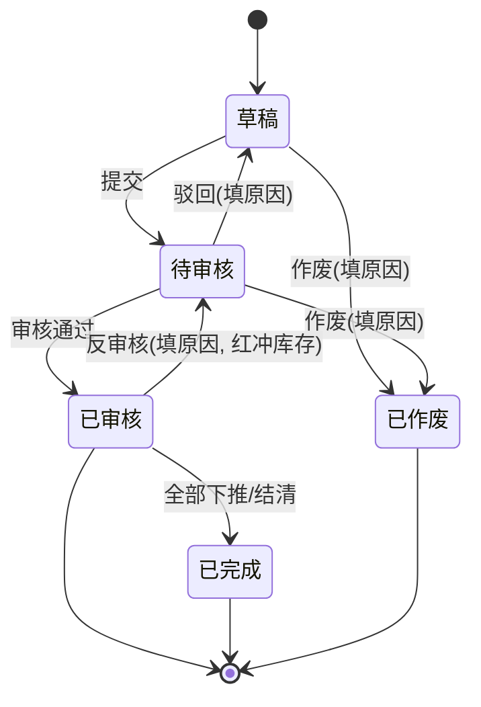
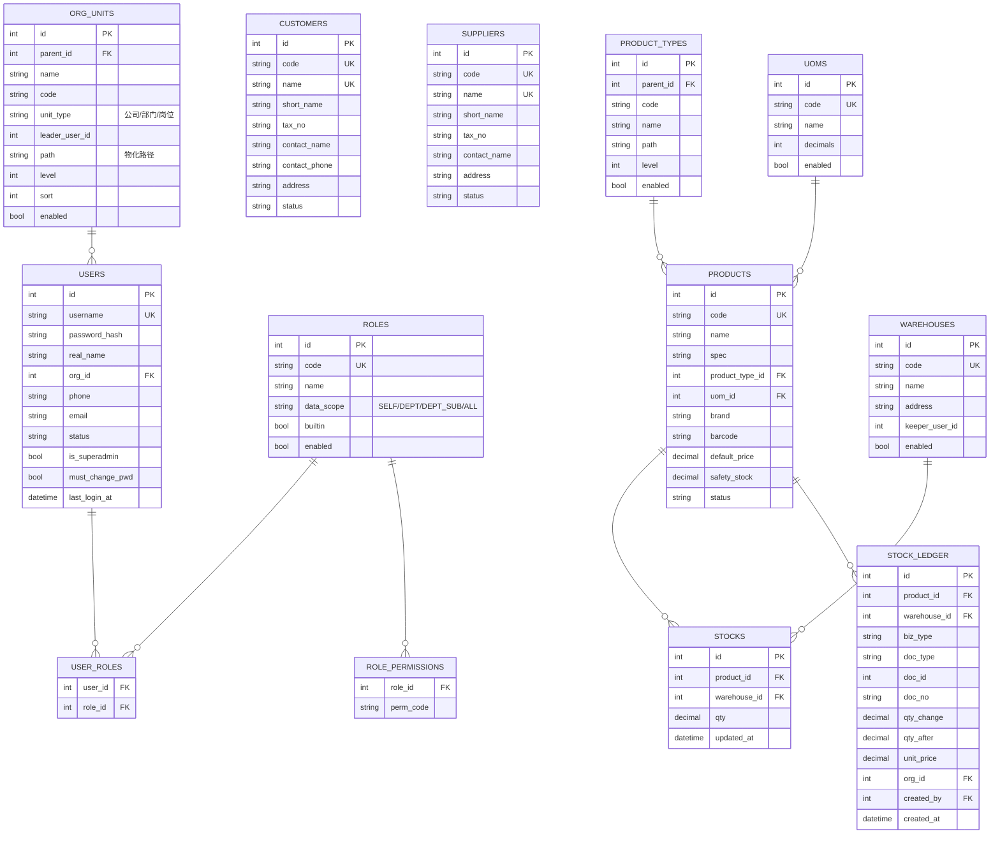

# 11. ERP 进销存改造需求规格（PRD V2.0）

项目名称：合同管理与跟踪系统 → **ERP 进销存（内网版，代号 CTMS）**
文档状态：**V2.0 草案（待评审冻结）**
编制依据：V1.0 已交付实现 + 本轮两阶段需求讨论确认口径（见第 17 节）
交付物定位：**本文档是 V2.0 版本的唯一规格依据**——开发按它实现，验收按它验收。

## 0. 与既有文档的关系

| 文档 | 关系 |
|---|---|
| `00-sdd-process.md` | 流程不变：本规格同样遵循"规格 → 实现 → 场景验证 → commit" |
| `01-requirements.md` | V1.0 合同管理规格。**合同模块继续有效**；本文档第 2 节对其中"无登录/无角色"等决策做正式修订 |
| `02-system-design.md` | V1.0 系统设计（留档）。**V2.0 详细设计见 `12-erp-system-design.md`** |
| `03-development-plan.md` | 开发计划。**V2.0 任务分解与排期见该文档第 9 节起** |
| `04-tech-route.md` | 技术路线不变（FastAPI + Vue3 + SQLite），仅新增认证与权限层设计 |
| `05-prototype-acceptance.md` | V1.0 原型验收报告（历史留档） |
| `06-mvp2-adjustments.md` / `07-mvp3-adjustments.md` | V1.0 期间的 MVP2/MVP3 增量调整（历史留档） |
| `08`~`10` | 部署相关文档（V1.0 留档） |

更新记录：

| 版本 | 说明 |
|---|---|
| V2.0-draft | 完成"改造为 ERP 进销存"方向的需求讨论与全部口径确认，形成本规格 |

---

## 1. 背景与目标

### 1.1 V1.0 现状（已完成）

合同管理已交付并可用，能力清单：

- 合同台账 CRUD、软删除 + 30 天恢复、变更历史（时间/字段/前后值）；
- 合同行项明细（类型/名称/规格/数量/单价/总价/备注）；
- 框架合同与子合同绑定、标签体系、附件上传下载预览；
- 质保金与到期提醒（站内看板）、状态机（内部审批中→…→到货/已终止）；
- 自动编号（类型码 + 主体码 + 年月 + 6 位序号，如 `PURZC202609000001`）；
- Excel 台账导出、批量导入（模板 + 失败原因回报）；
- 系统设置（合同类型、我方主体码、标签、行项类型字典，存于 `kv_settings`）。

### 1.2 为什么要向 ERP 进销存演进

V1.0 只解决"合同签了什么、钱付了多少、质保何时到期"，是**事后台账**。实际业务中：

1. 合同签了之后，"要买什么、买了多少、到货了没、库房还有多少、发给客户了没"全靠人问人；
2. 采购单、送货单、出库单散落在 Excel，无法与合同对账（合同金额 vs 实际下单/入库金额）；
3. 没有库存账，重复采购与缺料同时存在；
4. 单据谁提的、谁审的无法追溯（V1.0 无账号体系，是已知取舍）。

因此 V2.0 的目标是把系统从"合同台账"升级为**以合同为源头、以单据为过程、以库存为结果**的进销存系统。

### 1.3 本期目标（可衡量）

| 目标 | 衡量口径 |
|---|---|
| 全流程线上化 | 采购：申请单→采购单→入库；销售：申请单→销售订单→出库，全部可在系统内完成，不依赖线下 Excel |
| 库存账实相符 | 任一商品 × 仓库的结存数量 = 全部已审核出入库流水累计，且可下钻到每一笔来源单据 |
| 合同可对账 | 任一合同可查看其关联单据与"已执行数量/金额"，实现合同金额 + 已付金额 + 已下单/已入库金额三方对照 |
| 操作可追溯 | 每个单据/主数据变更均记录**操作人 + 时间 + 前后值**（修订 V1.0"不记录操作人"的取舍） |
| 权限可控 | 不同岗位看到不同菜单与不同范围的数据（本人/本部门/本部门及下级/全部） |

### 1.4 双向互动原则（与合同管理）

- **合同 → 单据**：采购单/入库单可挂采购类合同，销售订单/出库单可挂销售类合同，合同提供条款、金额基准与对方单位；
- **单据 → 合同**：合同详情页展示关联单据清单与执行汇总（**只读**，不回写合同字段，避免双向写冲突）；
- **不强制绑定**：允许无合同的零星采购/销售（现场实际存在），此时单据独立成立；
- **数据边界**：库存的增减**只由单据驱动**，合同本身不产生任何库存影响。

---

## 2. 版本决策与 V1.0 解冻记录

### 2.1 本次讨论确认的 12 项决策（口径基线）

| # | 决策点 | 确认结论 |
|---|---|---|
| D1 | 账号与权限 | **引入完整体系**：账号 + 角色 + 菜单权限 + 按钮权限 + 数据权限（按组织/部门隔离） |
| D2 | MVP 模块范围 | 资料库 7 项全含 + 基础信息（商品类型树/物料/计量单位/仓库）+ 采购申请单/采购单 + 销售申请单/销售订单 + 入库单/出库单/库存明细 + 盘点单 |
| D3 | 单据与合同关系 | **可关联**（非强制）；合同提供条款与金额；**库存按单据走** |
| D4 | 库存核算口径 | **多仓库 + 只记数量，不记成本**（无成本层、无批次、无保质期） |
| D5 | 单据审批 | **单级审核**：草稿→已提交→已审核(生效)→已完成/作废；**审核即触发库存过账** |
| D6 | 客户/供应商 | 合同甲乙方**改造为引用档案**，保留文本字段兜底并兼容历史 |
| D7 | 财务范围 | **MVP 不含财务**（无应收应付/收付款单/开票）；合同"累计已付"继续手工维护 |
| D8 | 技术底座 | **保持 SQLite + 现有自研迁移机制**（不引入 PostgreSQL/Alembic） |
| D9 | 数据权限规则 | 角色配菜单/按钮权限 + 数据范围枚举（本人 / 本部门 / 本部门及下级 / 全部） |
| D10 | 甲乙方映射 | 按合同类型映射：**PUR → 乙方引用供应商；SAL → 甲方引用客户**；另一侧保留文本 |
| D11 | 计量单位 | **只做单位字典，商品绑定单一基本单位**，不做多单位换算 |
| D12 | 合同联动深度 | **只读汇总**：合同详情看关联单据与已执行数量/金额，不回写合同字段 |

### 2.2 对 `01-requirements.md` 的正式修订（解冻声明）

| 位置 | V1.0 原文口径 | V2.0 修订 |
|---|---|---|
| `01` §2、§3（原 F10 取消说明） | 不做登录、不区分角色（纯内网信任模型） | **改为**：引入账号、角色、菜单/按钮权限与数据权限（D1） |
| `01` §6 范围外第 1 条 | 不做登录、账号、角色与任何权限控制 | **从范围外移除**；权限控制纳入 V2.0 范围 |
| `01` BR9 / BR12 | 变更历史只记时间与前后值，**不记录操作人** | **改为**：变更历史新增 `operator_id` / `operator_name`（操作人快照）；无账号访问的旧数据操作人显示为"—（V1.0 无账号期）" |
| `01` §6 范围外第 2 条 | 不做审批工作流/对接 OA | **部分修订**：本版实现**单据单级审核**（非工作流引擎，不做多级/条件分支/待办中心） |
| `04` §3.4 | 访问与账号：不做登录、不区分角色 | 同上修订；实现方案见 `12-erp-system-design.md` §3 |

> 修订理由：业务已从"3~4 人合同台账"扩展为多岗位协同的进销存，无权限体系无法支撑（采购与销售互见价格、仓管不应改合同、审核需要留痕）。修订不推翻 V1.0 数据模型，仅**叠加**认证与归属字段，改造成本可控。

---

## 3. 用户、组织与权限模型

### 3.1 组织架构（资料库 → 组织架构）

- 组织形式：**树形结构**，节点类型为 `公司 / 部门 / 岗位`，最多 5 级；
- 字段：节点名称、节点编码（可选）、上级节点、节点类型、负责人、联系电话、排序、启用状态；
- 规则：
  - 删除前置校验：**存在下级节点**或**存在归属账号**时不可删除，只能停用；
  - 停用节点不影响其下历史数据与历史单据的展示；
  - 组织树是"数据权限"的计算基础（见 3.5），因此**必须先建组织再建账号**；
  - 支持拖拽调整层级（P1，MVP 用"修改上级"下拉实现）。

### 3.2 账号管理（资料库 → 账号管理）

- 字段：登录名（唯一、不可改）、真实姓名、所属组织节点、手机、邮箱、状态（启用/停用）、是否超级管理员、首次登录强制改密标记、最近登录时间、备注；
- 规则：
  - 密码存储：标准库 `pbkdf2_hmac('sha256')` + 每账号随机盐，120000 轮（不引入额外加密依赖）；
  - 密码策略：长度 ≥ 8，需含字母与数字；忘记密码由管理员重置（内网无邮件，不支持自助找回）；
  - 停用账号：立即失效（后续请求 401/403），历史数据保留且显示其姓名；
  - 账号不物理删除（保留审计线索）；
  - 初始超管账号 `admin` 由初始化脚本创建，**首次登录强制修改密码**。

### 3.3 角色管理（资料库 → 角色管理）

- 角色字段：角色编码（唯一）、角色名称、数据范围（枚举）、备注、是否内置、启用状态；
- 一个账号可绑定**多个角色**，权限取并集、数据范围取**最宽**者；
- 权限维度两两正交：
  1. **菜单权限**：决定左侧导航与页面可见性；
  2. **按钮权限**：决定新增/编辑/提交/审核/作废/导出等动作是否可点；
  3. **数据范围**：决定查询能命中哪些数据（见 3.5）。
- 权限点的唯一真源是后端代码常量清单（`app/permissions.py`），角色-权限关系落库；这样可避免"权限点被误删导致系统不可用"。

### 3.4 预置角色与权限矩阵

| 动作 | 系统管理员 | 采购主管 | 采购员 | 销售主管 | 销售员 | 仓管员 | 财务 | 只读/管理层 |
|---|---|---|---|---|---|---|---|---|
| 资料库/系统管理维护 | ✅ | ❌ | ❌ | ❌ | ❌ | ❌ | ❌ | ❌ |
| 基础信息维护（物料/单位/仓库/类型） | ✅ | ❌ | ❌ | ❌ | ❌ | ❌ | ❌ | ❌ |
| 客户/供应商维护 | ✅ | ❌ | ❌ | ❌ | ❌ | ❌ | ❌ | ❌ |
| 合同查看 | ✅ | ✅ | ✅ | ✅ | ✅ | ✅ | ✅ | ✅ |
| 合同新增/编辑 | ✅ | ✅ | ✅ | ✅ | ✅ | ❌ | ❌ | ❌ |
| 采购申请/采购单 新增提交 | ✅ | ✅ | ✅ | ❌ | ❌ | ❌ | ❌ | ❌ |
| 采购申请/采购单 **审核** | ✅ | ✅ | ❌ | ❌ | ❌ | ❌ | ❌ | ❌ |
| 销售申请/销售订单 新增提交 | ✅ | ❌ | ❌ | ✅ | ✅ | ❌ | ❌ | ❌ |
| 销售申请/销售订单 **审核** | ✅ | ❌ | ❌ | ✅ | ❌ | ❌ | ❌ | ❌ |
| 入库/出库/盘点 新增提交 | ✅ | ❌ | ❌ | ❌ | ❌ | ✅ | ❌ | ❌ |
| 入库/出库/盘点 **审核（过账）** | ✅ | ❌ | ❌ | ❌ | ❌ | ✅ | ❌ | ❌ |
| 库存明细查看 | ✅ | ✅ | ✅ | ✅ | ✅ | ✅ | ✅ | ✅ |
| 导出 Excel | ✅ | ✅ | ✅ | ✅ | ✅ | ✅ | ✅ | ✅ |
| 操作日志查看 | ✅ | ❌ | ❌ | ❌ | ❌ | ❌ | ❌ | ❌ |

> 默认数据范围：系统管理员 = 全部；主管 = 本部门及下级；业务员/仓管 = 本人；财务/只读 = 全部（只读）。
> 表格为**默认值**，全部可在角色管理里改。

### 3.5 数据范围（Data Scope）计算规则

单据表统一冗余两个归属字段：`org_id`（创建时创建人所属组织节点快照）与 `created_by`（创建人账号 id）。

| 数据范围 | 查询过滤条件 |
|---|---|
| 本人 | `created_by = 当前用户` |
| 本部门 | `org_id = 当前用户所属节点` |
| 本部门及下级 | `org_id ∈ (当前用户所属节点及其全部下级节点)` |
| 全部 | 无附加条件 |

- 多角色取**最宽**范围；
- 超级管理员无视数据范围；
- **主数据不做数据隔离**：客户/供应商/物料/单位/仓库全公司共享（否则同一家单位会被各部门重复建档），其安全性由"菜单权限 + 按钮权限"控制；
- 数据范围**只在列表与详情查询生效**，不阻断按单据编号直查（P1 可加严格模式）。

### 3.6 审计留痕（修订 V1.0 BR12）

- `change_logs` 新增 `operator_id`、`operator_name`（快照）；合同及相关模块统一；
- 新增 `operation_logs`（操作日志）：登录/登出、审核/反审核/作废、权限与主数据变更、导出、备份，记录操作人、时间、对象、动作、结果、IP；
- V1.0 期间产生的历史记录操作人留空，界面显示"—"。

---

## 4. 功能需求总览

| 编号 | 一级模块 | 二级模块 | 说明 |
|---|---|---|---|
| F-V2-1 | **资料库** | 组织架构 | 公司/部门/岗位树 |
| F-V2-2 | | 角色管理 | 角色 + 菜单/按钮权限 + 数据范围 |
| F-V2-3 | | 账号管理 | 账号、重置密码、停启用、分配角色 |
| F-V2-4 | | 客户基本信息 | 客户档案（销售对象的唯一来源） |
| F-V2-5 | | 供应商基本信息 | 供应商档案（采购对象的唯一来源） |
| F-V2-6 | | 基础信息 | 商品类型树 / 物料档案 / 计量单位 / 仓库 |
| F-V2-7 | | 系统管理 | 整合 V1.0 系统设置 + 编号规则 + 操作日志 + 备份 + 系统参数 |
| F-V2-8 | **采购管理** | 采购申请单 | 需求发起与审核 |
| F-V2-9 | | 采购单 | 对供应商下单，可下推入库 |
| F-V2-10 | **销售管理** | 销售申请单 | 销售机会/要货申请与审核 |
| F-V2-11 | | 销售订单 | 对客户接单，可下推出库 |
| F-V2-12 | **库存管理** | 入库单 | 采购入库/退货入库/盘盈/其他 |
| F-V2-13 | | 出库单 | 销售出库/领用/盘亏/其他 |
| F-V2-14 | | 库存明细 | 商品 × 仓库结存 + 流水下钻 |
| F-V2-15 | | 盘点单 | 全盘/抽盘，差异自动调整库存 |
| F-V2-16 | **合同管理（存量）** | 合同台账 | V1.0 能力保留 + 甲乙方档案化改造 + 关联单据区块 |
| F-V2-17 | **首页** | 看板 | 本版保留 V1.0 看板；**重规划列入 M4**（D2 未纳入本版范围） |

---

## 5. 资料库（F-V2-1 ~ F-V2-7）

### 5.1 组织架构（F-V2-1）

| 字段 | 类型 | 必填 | 说明 |
|---|---|---|---|
| 上级节点 | 树选择 | 根可空 | 空 = 顶级公司 |
| 节点名称 | 文本(64) | ✅ | 全树同名允许，同父下唯一 |
| 节点编码 | 文本(32) | ❌ | 建议用拼音缩写，用于报表归集 |
| 节点类型 | 枚举 | ✅ | 公司 / 部门 / 岗位 |
| 负责人 | 账号选择 | ❌ | |
| 联系电话 | 文本(32) | ❌ | |
| 排序 | 数字 | ❌ | 同级升序 |
| 启用 | 开关 | ✅ | 默认启用 |

交互：左侧树 + 右侧详情表单；支持搜索节点名称；显示各节点账号数。

### 5.2 角色管理（F-V2-2）

- 列表：角色编码、名称、数据范围、账号数、启用状态；
- 编辑：基本信息 + **权限树勾选**（按模块分组，菜单与按钮两级）+ 数据范围下拉；
- 内置角色不可删除（可改权限，但系统管理员角色的"系统管理"权限不可摘除）；
- 保存后立即生效（已登录用户权限实时重算，不做前端缓存）。

### 5.3 账号管理（F-V2-3）

- 列表：登录名、姓名、所属组织、角色、状态、最近登录时间；
- 新增：登录名唯一校验、初始密码（管理员设定，用户首登强制改密）、组织、角色（多选）；
- 操作：编辑、停用/启用、重置密码、查看该账号的操作日志；
- 不可停用/删除自己；不可停用最后一个超级管理员。

### 5.4 客户基本信息（F-V2-4）

| 字段 | 必填 | 说明 |
|---|---|---|
| 客户编码 | ✅ | 自动生成 `CUS0001` 递增，可手工指定（唯一校验） |
| 客户名称 | ✅ | 全库唯一 |
| 简称 | ❌ | 用于列表与单据打印 |
| 税号 | ❌ | |
| 联系人 / 联系电话 | ❌ | |
| 地址 | ❌ | 销售订单默认收货地址来源 |
| 开户行 / 银行账号 | ❌ | |
| 信用额度 | ❌ | 仅记录，本期不做超限拦截 |
| 客户等级 | ❌ | A/B/C |
| 状态 | ✅ | 启用/停用（停用后不可在新单据中选用，历史单据保留） |
| 备注 | ❌ | |

### 5.5 供应商基本信息（F-V2-5）

字段与客户基本对称：供应商编码（`SUP0001`）、名称（唯一）、简称、税号、联系人/电话、地址、开户行/账号、供货范围、账期（天，仅记录）、状态、备注。

### 5.6 基础信息（F-V2-6）

#### 5.6.1 商品类型（树形）

- 树形结构，最多 5 级；字段：上级、类型编码、类型名称、排序、启用；
- 物料必须挂在**叶子节点**上（保证分类统计不重复）；
- 删除校验：存在子类型或存在物料时不可删除，只能停用。

#### 5.6.2 物料档案（物料编码）

| 字段 | 必填 | 说明 |
|---|---|---|
| 物料编码 | ✅ | 支持两种模式：① 自动生成 `{商品类型码}{4 位流水}`；② 手工录入（唯一校验）。全局唯一、不可改 |
| 物料名称 | ✅ | |
| 规格型号 | ❌ | |
| 商品类型 | ✅ | 叶子节点 |
| 基本单位 | ✅ | 引用计量单位字典；**一个物料只有一个基本单位**（D11） |
| 品牌 / 条形码 | ❌ | |
| 参考单价 | ❌ | 开单时默认带出，可改 |
| 安全库存 | ❌ | 库存明细低于该值高亮（M3 做提醒） |
| 状态 | ✅ | 启用/停用 |
| 备注 | ❌ | |

#### 5.6.3 计量单位

- 字段：单位编码（如 `PCS`）、单位名称（如 `个`）、小数位（0~4，默认 2）、启用、备注；
- 小数位用于**数量录入校验与展示**：选择"个"（0 位）时不允许录入 1.5；
- 库存结存数量按物料基本单位的小数位存储与展示。

#### 5.6.4 仓库

- 字段：仓库编码（如 `WH01`）、仓库名称、地址、仓管员（账号选择）、启用、备注；
- 多仓库（D4）：所有出入库与盘点都以"仓库"为维度；
- 停用仓库：不可在新单据选用，库存明细仍可查询。

### 5.7 系统管理（F-V2-7，整合 V1.0 系统设置）

采用**子页签**结构，整合原有分散设置：

| 子模块 | 内容 | 来源 |
|---|---|---|
| 数据字典 | 合同类型（含编号码）、我方主体码、标签管理、行项类型 | 迁移自 V1.0 `/settings` |
| 编号规则 | 查看各类单据/主数据编号前缀与序号规则；可选"允许手工改号"开关 | 新增 |
| 系统参数 | 质保到期提醒窗口天数（默认 30）、是否允许负库存（默认否）、数量/单价/金额小数位默认值、密码最小长度、单据是否允许创建人自审（默认否） | 新增 |
| 操作日志 | 全局查询：时间范围、操作人、模块、动作、结果 | 新增（3.6） |
| 变更历史 | 全局查询（按对象类型 + 对象编号） | V1.0 已有（按合同），扩展 |
| 数据备份 | 手动生成备份包并下载（SQLite 文件 + 附件目录打包为 zip） | 新增 |
| 关于 | 应用名、版本、数据库类型、数据量统计 | 新增 |

---

## 6. 采购管理（F-V2-8 / F-V2-9）

### 6.1 采购申请单（F-V2-8）

用途：业务/生产/项目部门提出采购需求，经主管审核后作为采购下单的依据。

**表头字段**

| 字段 | 必填 | 说明 |
|---|---|---|
| 申请单号 | ✅ | 自动生成 `PR{YYYYMM}{6位}`，不可改 |
| 申请日期 | ✅ | 默认当天 |
| 申请部门 | ✅ | 默认创建人所属组织节点，可改（影响数据范围归属） |
| 需求日期 | ❌ | 期望到货日期 |
| 关联合同 | ❌ | 仅可选**采购类（PUR）**合同；选中后带出供应商建议 |
| 建议供应商 | ❌ | 引用供应商档案 |
| 用途说明 | ❌ | |
| 备注 | ❌ | |
| 状态 | ✅ | 系统维护 |

**行项字段**：序号、物料（必选档案）、物料编码/名称/规格（快照、只读）、单位、申请数量、参考单价、参考金额（自动）、需求日期、备注。

**规则**
- 至少 1 行；数量 > 0；物料不可重复（同物料多需求合并为一行，或允许重复但提示）；
- 提交后不可编辑（需先撤回/驳回）；
- 审核通过后**可下推生成采购单**（一次或多次，支持部分下单），并记录已下单数量；
- 申请单行项显示"已下单数量 / 申请数量"，超额下单拦截。

### 6.2 采购单（F-V2-9）

用途：向供应商正式下单，货物到达后下推生成入库单。

**表头字段**：采购单号（`PO{YYYYMM}{6位}`）、下单日期、供应商（必选档案，名称快照）、采购部门、关联合同（可选，PUR 类）、来源采购申请单（可选，下推时自动带入）、预计到货日期、结算方式（仅记录文本/字典）、币种（默认 CNY）、金额合计（自动）、经办人（默认创建人）、收货仓库（默认，可被入库单覆盖）、备注、状态。

**行项字段**：序号、物料、编码/名称/规格快照、单位、数量、单价（含税，本期不做税额拆分）、金额（数量 × 单价，2 位小数）、预计到货日期、已入库数量（系统汇总）、备注。

**规则**
- 单价 > 0（允许 0 用于赠品，需备注）；数量 > 0；
- 审核通过后**可下推生成入库单**，支持部分入库；行项显示"已入库数量 / 数量"，超量入库拦截；
- 已入库的采购单不可直接作废，需先反审核对应入库单；
- 采购单金额合计与关联合同金额**不做强校验**（D12），仅在合同详情做只读对照。

---

## 7. 销售管理（F-V2-10 / F-V2-11）

### 7.1 销售申请单（F-V2-10）

用途：销售机会或客户要货的内部申请，审核后转销售订单。

**表头字段**：申请单号（`SR{YYYYMM}{6位}`）、申请日期、客户（可选，引用客户档案）、客户名称（文本兜底，用于尚无档案的意向客户）、申请部门、期望交付日期、关联合同（可选，SAL 类）、备注、状态。

**行项字段**：物料、快照字段、单位、申请数量、参考单价、参考金额、备注。

**规则**：同采购申请单（行项校验、下推生成销售订单、已转订单数量跟踪）。

### 7.2 销售订单（F-V2-11）

**表头字段**：销售订单号（`SO{YYYYMM}{6位}`）、订单日期、客户（必选档案，名称快照）、销售部门、关联合同（可选，SAL 类）、来源销售申请单（可选）、交付日期、收货地址（默认取客户地址，可改）、联系人/电话、发货仓库（默认）、币种、金额合计、经办人、备注、状态。

**行项字段**：序号、物料、快照、单位、数量、单价、金额、已出库数量（系统汇总）、备注。

**规则**
- 审核通过后可下推生成出库单，支持部分出库；显示"已出库数量 / 数量"，超量出库拦截；
- 出库时校验库存是否充足（见 8.2）；
- 与销售合同金额不做强校验。

---

## 8. 库存管理（F-V2-12 ~ F-V2-15）

### 8.1 入库单（F-V2-12）

**表头字段**

| 字段 | 必填 | 说明 |
|---|---|---|
| 入库单号 | ✅ | `IN{YYYYMM}{6位}` |
| 入库日期 | ✅ | 默认当天 |
| 仓库 | ✅ | 引用仓库档案（表头级，行项可覆盖，默认取表头） |
| 入库类型 | ✅ | 采购入库 / 退货入库 / 盘盈入库 / 其他入库 |
| 来源采购单 | ❌ | 下推时带入；可选择已审核未入库完的采购单 |
| 供应商 | ❌ | 采购入库时默认取采购单供应商 |
| 关联合同 | ❌ | 采购入库时默认取采购单合同 |
| 备注 / 附件 | ❌ | 附件支持上传送货单、发票扫描件 |

**行项字段**：序号、物料、快照、单位、**入库数量**、单价、金额、仓库（可覆盖表头）、来源采购单行（下推时记录，用于回写已入库数量）、备注。

**规则**
- 采购入库必须锁定来源采购单（手工零星入库可用"其他入库"）；
- 审核通过 → **触发库存过账（+数量）**，单据状态直接置为"已审核"（终态），记流水；
- 反审核：仅当未产生下游动作（如未被其他单据引用）时允许，反审核**红冲**库存并写反向流水，必须填原因。

### 8.2 出库单（F-V2-13）

字段与入库单对称：出库单号（`OUT{YYYYMM}{6位}`）、出库日期、仓库、出库类型（销售出库 / 领用出库 / 盘亏出库 / 其他出库）、来源销售订单、客户、关联合同、行项（出库数量、单价、金额、仓库）。

**规则**
- 审核前做**可用库存校验**：若 `结存数量 - 出库数量 < 0` 且系统参数"允许负库存"= 否 → **拦截并提示**（列出不足的商品与仓库）；
- 审核通过 → 库存过账（−数量）；
- 反审核 → 红冲；发货后客户退货走"退货入库"，不在出库单上做负数。

### 8.3 库存明细（F-V2-14）

**视图一：库存结存（默认页）**

| 列 | 说明 |
|---|---|
| 物料编码 / 名称 / 规格 / 商品类型 | 主数据快照（实时取档案） |
| 单位 | 物料基本单位 |
| 仓库 | 多仓库分列或按行展开（默认按物料 + 仓库一行） |
| 结存数量 | `stocks.qty` |
| 安全库存 | 低于则整行高亮（预警） |
| 最近变动时间 | 最后一次流水时间 |
| 操作 | 查看流水 |

**视图二：库存流水（点击"查看流水"）**

按 商品 + 仓库 展示 `stock_ledger` 全部明细：日期、业务类型、来源单号（可点击跳转）、数量变动（+/−）、变动后结存、单价、操作人。

**规则**
- 结存数量**只能**由过账服务维护，界面不提供直接改库存的入口；
- 支持按仓库、商品类型、物料关键字、是否低于安全库存筛选；支持导出 Excel；
- 结存数量必须等于该商品+仓库全部流水 `qty_change` 之和（提供"库存重算"运维校验功能）。

### 8.4 盘点单（F-V2-15）

**表头字段**：盘点单号（`ST{YYYYMM}{6位}`）、盘点日期、仓库（必选）、盘点方式（**全盘 / 抽盘**）、盘点范围说明、备注、状态。

**行项字段**：序号、物料、快照、单位、**账面数量**（生成时从 `stocks` 快照，只读）、**实盘数量**（手工录入）、**差异数量**（= 实盘 − 账面，自动）、差异原因、备注。

**规则**
- 全盘：对所选仓库**全部有结存或有流水的商品**生成行项（账面为 0 且从未有流水的商品不生成，除非手工添加）；
- 抽盘：按商品类型 / 物料关键字筛选生成行项，或手工逐条添加；
- 实盘数量为必填才可提交；差异 ≠ 0 的行建议填写差异原因；
- **审核时**：
  1. 逐行生成差异流水（正数 = 盘盈，负数 = 盘亏）；
  2. 自动生成关联的**盘盈入库单 / 盘亏出库单**（类型分别为"盘盈入库""盘亏出库"，来源 = 本盘点单），保证库存变动都有单据可追溯；
  3. 盘点单置为"已审核"，并显示生成的单据号；
- 盘点单审核后不可修改；反审核需先反审核其生成的盘盈/盘亏单（或由反审核级联处理，见 BR-V2-06）；
- 盘点期间不锁库存（多人 3~4 人，接受"账面快照与实盘时点差异"，在盘点单上记录盘点时点）。

---

## 9. 与合同管理的互动（F-V2-16）

### 9.1 合同甲乙方档案化改造（D6 / D10）

- `contracts` 表**新增**可空字段 `customer_id`、`supplier_id`，**保留** `party_a`、`party_b` 文本字段（兜底与历史兼容）；
- 映射规则：
  - 采购类合同（类型码 `PUR`）：**乙方 → 供应商档案**（`supplier_id`），甲方保留文本（可能是我方集团/总包方）；
  - 销售类合同（类型码 `SAL`）：**甲方 → 客户档案**（`customer_id`），乙方保留文本；
  - 其他类型（COO/LAB/FIN/NDA/OTH）：不做映射，维持纯文本；
- 表单交互：类型为 PUR 时"乙方"变为**供应商选择器**（可切回文本输入）；类型为 SAL 时"甲方"变为**客户选择器**；
- 列表/导出：展示档案名称（无档案则显示原文本）；
- 保存合同时写入档案名称快照到文本字段，保证导出与打印的稳定性。

### 9.2 历史数据迁移工具（一次性）

1. 扫描 `contracts.party_a` / `party_b` 去重文本；
2. 按合同类型生成**客户/供应商档案草案**（状态 = 停用，命名加标记"（待确认）"）；
3. 提供"档案认领"页面：人工确认草案 → 启用档案 → 批量绑定合同；
4. 未确认的合同继续使用文本显示（不阻塞业务）。

### 9.3 合同详情新增"关联单据"区块

- 展示关联的采购申请/采购单/入库单（PUR 合同）或销售申请/销售订单/出库单（SAL 合同）；
- 汇总（**只读，不回写**）：关联单据数、已下单金额、已入库数量/金额、已出库数量/金额；
- 与合同字段对照显示：合同金额 / 累计已付（手工）/ 已执行金额（单据汇总），明确标注口径差异，避免误读。

### 9.4 单据侧

- 采购单/入库单的"关联合同"下拉**只列出对应类型**且未作废的合同；
- 单据详情显示合同编号（可点击跳转合同详情）；
- 不强制填写；不因合同状态（如"已终止"）自动作废单据（提示但允许）。

---

## 10. 单据通用规则

### 10.1 编号规则（BR-V2-01）

| 对象 | 前缀 | 编号格式 | 示例 |
|---|---|---|---|
| 采购申请单 | PR | 前缀 + YYYYMM + 6 位序号 | `PR202609000001` |
| 采购单 | PO | 同上 | `PO202609000001` |
| 销售申请单 | SR | 同上 | `SR202609000001` |
| 销售订单 | SO | 同上 | `SO202609000001` |
| 入库单 | IN | 同上 | `IN202609000001` |
| 出库单 | OUT | 同上 | `OUT202609000001` |
| 盘点单 | ST | 同上 | `ST202609000001` |
| 客户 / 供应商 | CUS / SUP | 前缀 + 4 位序号（全局不按月） | `CUS0001` |
| 物料 | 商品类型码 + 4 位流水（或手工） | — | `01010001` |

- 序号按「前缀 + 年 + 月」递增，**跨年跨月自动重置**；
- 采用"库内最大值 + 1"推算（与 V1.0 `numbering.py` 一致），配合唯一索引 + 冲突重试，避免并发跳号；
- 单据编号**不可修改**；主数据编码创建后不可修改。

### 10.2 单据状态机（BR-V2-02）

- **申请单 / 采购单 / 销售订单**：状态集合为 草稿 / 待审核 / 已审核 / 已完成 / 已作废（+ 驳回回到草稿）；
- **入库单 / 出库单 / 盘点单**：审核即过账，状态集合为 草稿 / 待审核 / 已审核 / 已作废（"已审核"即终态，不需要额外的"已完成"动作）；
- 状态流转**必须**写变更历史（含操作人、时间、原因）；
- 状态为"待审核/已审核/已完成"的单据**不可编辑**（需先撤回或反审核）。

### 10.3 审核与过账（BR-V2-03）

- 审核人 = 拥有该单据 `approve` 权限的账号；默认**不允许创建人自审**（系统参数可放开）；
- 过账时机：**审核通过时**，与单据状态变更在同一数据库事务内完成；
- 过账内容：写 `stock_ledger` 流水 + 更新 `stocks` 结存 + 回写来源单据的已执行数量（采购单已入库、销售订单已出库）；
- **幂等**：过账前检查该单据是否已过账（`posted` 标记），重复审核不产生二次影响；
- 反审核：`已审核 → 待审核`，生成**反向流水（红字）**，回退来源单据的已执行数量，必须填写原因；已产生下游单据时不允许反审核上游单据；
- 所有过账动作写操作日志。

### 10.4 行项规则（BR-V2-13）

- 每张单据至少 1 行；数量 > 0（数量为 0 的行不允许保存）；
- 金额 = 数量 × 单价，四舍五入 2 位；单据金额合计 = 各行金额之和（**先舍入再汇总**，与打印/导出一致）；
- 数量精度 = 物料基本单位的小数位；单价 4 位小数；金额 2 位小数；
- 物料必须选择档案（**不允许自由文本行**），保证库存可记账；行项保存物料编码/名称/规格/单位**快照**，档案改名不影响历史单据；
- 同单据内同一物料 + 仓库重复时提示合并（不强制）。

### 10.5 来源单据下推（BR-V2-17）

- 支持的下推路径：采购申请 → 采购单 → 入库单；销售申请 → 销售订单 → 出库单；盘点单 → 盘盈/盘亏单（系统自动）；
- 下推时按"剩余可执行数量"预填，可修改（不超过剩余量）；
- 单据行项记录来源单号与来源行 id，来源单据列表可反查下游单据；
- 上游单据被作废/反审核时，若已存在下游单据则拦截并提示。

### 10.6 删除与作废策略（BR-V2-15）

- **草稿**单据可直接物理删除（写操作日志）；
- **已提交/已审核**单据只能"作废"（软处理），必须填原因并写入变更历史；
- 已过账单据作废 = 先反审核（红冲库存）再作废；
- 主数据（物料/客户/供应商/单位/仓库/组织/账号）不做物理删除，一律"停用"，历史数据保留可查。

### 10.7 附件、导出与打印

- 附件：复用 V1.0 附件机制，扩展到全部单据（白名单、20MB/文件、随机文件名、删除留痕）；
- 导出：所有列表页支持"导出当前筛选结果为 Excel"（服务端生成，中文表头，文件名带日期）；
- 打印：单据详情提供浏览器打印（A4 纵向，含表头信息 + 行项 + 合计 + 审批信息），**不做套打模板**。

### 10.8 列表页通用能力

- 组合筛选（编号、日期区间、状态、物料、对方单位、经办人、关联合同）+ 分页（默认 20 条/页）；
- 排序（单据日期、金额、最近更新）；
- 快捷筛：待我审核、我创建的单据、本月单据；
- 批量操作：批量导出；批量提交（P1）。

---

## 11. 数据模型概览（V2.0）

> 详细 DDL、索引与服务设计见 `12-erp-system-design.md`。此处为实体与关键字段概览，供开发对齐。

### 11.1 新增实体

### 11.2 单据实体（8 张主表 + 8 张行项表）

统一采用「主表 + 行项表」模式，主表公共字段（用 SQLAlchemy Mixin 复用）：

| 公共字段 | 说明 |
|---|---|
| `id` / `doc_no`(UK) | 主键 / 单据编号 |
| `doc_date` | 单据日期 |
| `status` | 草稿/待审核/已审核/已完成/已作废 |
| `org_id` / `created_by` | 归属组织（数据范围）、创建人 |
| `remark` | 备注 |
| `contract_id` | 关联合同（可空） |
| `source_doc_type` / `source_doc_id` | 来源单据 |
| `submitted_by` / `submitted_at` | 提交人与时间 |
| `approved_by` / `approved_at` | 审核人与时间 |
| `voided_by` / `voided_at` / `void_reason` | 作废人/时间/原因 |
| `posted` | 是否已过账（库存类单据） |
| `deleted` / `created_at` / `updated_at` | 软删除与时间戳 |

行项表公共字段：`id`、`doc_id`、`seq`、`product_id` + 快照（`product_code`/`product_name`/`spec`/`uom`）、`qty`、`unit_price`、`amount`、`warehouse_id`、`src_item_id`、`remark`。

各单据特有字段（表头）：

| 单据 | 特有字段 |
|---|---|
| 采购申请单 | `request_dept_id`、`need_date`、`suggest_supplier_id`、`purpose` |
| 采购单 | `supplier_id` + 快照、`purchase_dept_id`、`expected_arrival_date`、`settle_type`、`currency`、`total_amount`、`receipt_warehouse_id`、`handler_user_id` |
| 销售申请单 | `customer_id`（可空）、`customer_name_text`、`sales_dept_id`、`expect_delivery_date` |
| 销售订单 | `customer_id` + 快照、`sales_dept_id`、`delivery_date`、`delivery_address`、`contact_name`、`contact_phone`、`ship_warehouse_id`、`currency`、`total_amount`、`handler_user_id` |
| 入库单 | `warehouse_id`、`in_type`、`supplier_id`、`total_amount` |
| 出库单 | `warehouse_id`、`out_type`、`customer_id`、`total_amount` |
| 盘点单 | `warehouse_id`、`take_type`（全盘/抽盘）、`scope_note`、`generated_in_id`、`generated_out_id` |

行项特有字段：入库/出库行项含仓库覆盖与来源行；盘点行项含 `book_qty`、`actual_qty`、`diff_qty`、`diff_reason`；采购申请/销售申请行项含 `ordered_qty`（已下推数量）。

### 11.3 对 V1.0 既有表的改动

| 表 | 改动 |
|---|---|
| `contracts` | 新增 `customer_id`、`supplier_id`（可空）；新增 `org_id`、`created_by`（数据范围与审计） |
| `change_logs` | 新增 `operator_id`、`operator_name`；新增 `object_type`/`object_id`（支持非合同对象） |
| `attachments` | 新增 `object_type`/`object_id`（支持单据附件）；`contract_id` 允许为空 |
| `kv_settings` | 扩展键：`sys_params`、`number_rules`（保持 JSON KV 方式，不建独立字典表） |

迁移方式：沿用 `app/db_migrate.py` 的 `ensure_schema_upgrades()` 幂等加列，**不引入 Alembic**（D8）。

---

## 12. 业务规则清单（BR-V2）

| 编号 | 规则 |
|---|---|
| BR-V2-01 | 单据与主数据编号规则见 10.1；编号唯一、不可改、按月重置、并发防重 |
| BR-V2-02 | 单据状态机见 10.2；状态流转必须留痕（操作人/时间/原因） |
| BR-V2-03 | 审核即过账，同事务、幂等；反审核红冲并回退已执行数量 |
| BR-V2-04 | 库存结存只能由过账服务维护；界面禁止直接改库存；结存 = 流水累计 |
| BR-V2-05 | 负库存默认不允许（系统参数可开）；出库/盘亏审核前校验可用量并给出明细提示 |
| BR-V2-06 | 盘点差异审核后自动生成盘盈入库单/盘亏出库单；反审核盘点单需级联处理其生成单据 |
| BR-V2-07 | 单据与合同**可关联非强制**；关联时按类型限定（PUR 合同 ↔ 采购单据，SAL 合同 ↔ 销售单据）；合同执行数据只读汇总，不回写合同 |
| BR-V2-08 | 权限三层：菜单权限控可见、按钮权限控动作、数据范围控数据；多角色权限并集、数据范围取最宽 |
| BR-V2-09 | 主数据唯一性：客户名称、供应商名称、物料编码、单位编码、仓库编码、账号登录名、角色编码全局唯一（停用项也占用） |
| BR-V2-10 | 组织节点删除需无下级且无归属账号；账号不可删除只能停用；不可停用最后一个超管与自己 |
| BR-V2-11 | 密码策略：≥8 位含字母与数字；pbkdf2_hmac 加盐存储；管理员重置后首登强制改密 |
| BR-V2-12 | 审计：登录/审核/反审核/作废/权限变更/主数据变更/导出/备份均写操作日志；业务变更写变更历史（含操作人） |
| BR-V2-13 | 行项规则见 10.4：至少 1 行、数量 > 0、物料必选档案、金额先舍入再汇总、快照存储 |
| BR-V2-14 | 数量精度 = 物料基本单位小数位；单价 4 位；金额 2 位；币种本期不参与换算（仅记录） |
| BR-V2-15 | 删除与作废策略见 10.6：草稿可删，已提交/已审核只能作废填原因；主数据只能停用 |
| BR-V2-16 | 导出/打印口径见 10.7：导出与筛选一致，打印为 A4 浏览器打印 |
| BR-V2-17 | 下推规则见 10.5：按剩余量预填、可改但不超量；上游作废/反审核时有下游单据则拦截 |
| BR-V2-18 | 单据归属 `org_id` 在创建时按创建人组织节点快照（可改，但仅限有权限者），用于数据范围计算 |
| BR-V2-19 | 物料必须挂在商品类型**叶子节点**；停用商品类型/物料不影响历史单据展示 |
| BR-V2-20 | 历史数据兼容：合同甲乙方保留文本；档案未认领时以文本展示；旧变更历史操作人显示"—" |

---

## 13. 非功能需求

| 类别 | 要求 |
|---|---|
| 易用性 | 开单（含 5 行行项）< 2 分钟；常用筛选两步内完成；新用户 30 分钟上手 |
| 性能 | 内网单表万级数据列表响应 < 1s；库存结存查询 < 500ms；单据审核过账 < 1s |
| 并发 | 3~4 人并发；编号生成并发安全（唯一索引 + 重试）；过账使用事务串行 |
| 可靠性 | 每日自动备份（SQLite 文件 + 附件目录）；提供手动备份下载；季度恢复演练 |
| 安全 | 认证（JWT）+ 密码加盐哈希 + 上传白名单 + 参数校验 + ORM 防注入；权限校验在**后端**强制执行（前端隐藏仅是体验优化） |
| 可维护性 | 单体分层：`routers/`（接口）+ `services/`（业务）+ `models_*.py`（模型）；文档随代码更新 |
| 可扩展性 | 库存不记成本，但 `stock_ledger.unit_price` 与行项金额已预留，后续加成本层不需重构数据结构 |
| 兼容性 | 内网 Chrome/Edge；全流程 UTF-8 中文；不依赖外网资源 |

---

## 14. 范围外（V2.0 明确不做）

1. 财务模块：应收应付、收付款单、开票、核销、财务凭证；
2. 库存成本核算：移动加权平均、先进先出、批次成本、库存金额账；
3. 批次/序列号/保质期管理；
4. 多单位换算（基本单位 + 辅助单位）；
5. 多级审批、条件审批、审批流引擎、待办中心、消息推送；
6. 生产制造（BOM、工单、领料）、MRP 运算；
7. 价格体系（客户等级价、阶梯价、促销价）；
8. 对接外部系统（OA/ERP/税务/银行）、API 开放平台；
9. 移动端 App（页面自适应即可）；
10. 短信/邮件/企业微信通知；
11. 首页看板重规划（**列入 M4**，见 15）；
12. PostgreSQL 迁移与 Alembic；
13. 单据套打模板、条码/二维码打印。

---

## 15. 分期与里程碑（V2.0 内）

| 阶段 | 内容 | 交付与验收 | 预估 |
|---|---|---|---|
| **M1 权限与主数据地基** | 组织架构、角色、账号、认证登录、菜单/按钮/数据权限框架；基础信息（商品类型树/物料/计量单位/仓库）；客户/供应商档案；系统管理整合；合同甲乙方档案化改造 + 历史迁移工具 | 能用不同角色登录看到不同菜单与不同范围数据；能建全套主数据；合同旧数据正常显示 | 1.5~2 周（紧凑口径） |
| **M2 采购线与库存过账** | 采购申请单、采购单、入库单；库存过账服务、库存明细（结存 + 流水）；单据 ↔ 合同关联与合同详情"关联单据"区块 | 采购闭环跑通（申请→采购→入库→库存增加）；合同可看已执行金额 | 2~2.5 周（紧凑口径） |
| **M3 销售与盘点** | 销售申请单、销售订单、出库单、盘点单；负库存校验、下推与反审核红冲 | 销售闭环跑通（申请→订单→出库→库存减少）；盘点差异自动生成调整单 | 1.5~2 周（紧凑口径） |
| **M4 收尾** | 导出/打印完善、权限矩阵复核、安全与备份演练、**首页看板重规划**、UAT、文档更新 | 全部 AC 通过；三类用户 UAT ≥ 80% 场景无异议 | 1~1.5 周（紧凑口径） |

合计 **6~7.5 周（紧凑理想口径）**。

> ⚠️ **工期修正（见 `03-development-plan.md` §9.4）**：按任务实际估算为 **46.5 人日**，即**单人 9~10 周 / 前后端各 1 人 5~6 周**。上表为不含返工与沟通损耗的理想值，排期请以 `03` 为准。

每完成一个功能（一组 AC 全绿）即 commit 一次（`feat: [AC-V2-xx] 功能名`）。

**推荐 M1 先行独立上线**：即使后续阶段延后，权限与主数据地基也能立刻改善现状（操作可追溯、数据规范），风险最低。

---

## 16. 验收场景清单（AC-V2）

> P0 = 本版必做必验；P1 = 本版实现但可延后验收。
> 每条场景在对应功能完成时逐条勾选，形成《V2.0 验收报告》。

### 权限与账号

**AC-V2-01 登录与鉴权（P0）**
- Given 已创建账号 `buyer01`（采购员）且状态启用
- When 使用错误密码登录，再用正确密码登录
- Then 错误密码返回"用户名或密码错误"且写操作日志；正确密码返回登录态并进入首页（菜单只含其权限范围）

**AC-V2-02 未登录拦截（P0）**
- Given 未登录状态
- When 直接访问 `/api/purchase/orders` 或前端任意业务页面
- Then 接口返回 401，前端跳转登录页

**AC-V2-03 菜单与按钮权限（P0）**
- Given 角色"仓管员"未授予"采购单-审核"权限
- When 仓管员登录后打开采购单列表
- Then 左侧无"采购管理"菜单或仅有查看项；采购单详情无"审核"按钮；**直接调用审核接口返回 403**

**AC-V2-04 数据范围-本人（P0）**
- Given 采购员 A（范围=本人）与采购员 B 各创建 1 张采购申请单
- When A 打开采购申请单列表
- Then 只看到自己创建的 1 张；B 的不可见

**AC-V2-05 数据范围-本部门及下级（P0）**
- Given 采购主管（范围=本部门及下级）位于"采购部"，采购部下有"采购一组"
- When 采购主管打开列表
- Then 可见采购部及采购一组所有成员创建的单据，其他部门不可见

**AC-V2-06 多角色权限并集（P1）**
- Given 账号同时拥有"采购员"（本人）与"财务"（全部只读）角色
- When 打开采购单列表
- Then 数据范围按最宽的"全部"生效，但写操作仍受采购员权限限制

**AC-V2-07 组织节点删除校验（P0）**
- Given 组织节点"采购部"下存在子节点或归属账号
- When 执行删除
- Then 系统拒绝并提示原因，只能停用

**AC-V2-08 首登强制改密与管理员重置（P0）**
- Given 新建账号使用初始密码
- When 首次登录
- Then 强制跳转修改密码页，未修改前无法访问其他页面；管理员重置密码后该账号下次登录再次强制改密

### 主数据

**AC-V2-09 商品类型树与物料挂载（P0）**
- Given 商品类型树 `办公用品 > 纸张`
- When 新增物料并选择非叶子节点"办公用品"保存
- Then 系统拒绝并提示"请选择末级分类"；选择"纸张"可保存成功

**AC-V2-10 物料编码唯一与自动生成（P0）**
- Given 商品类型码为 `01`
- When 在该类型下新增物料不填编码
- Then 系统自动生成 `01010001`；再次新增生成 `01010002`；手工填入已存在编码时提示重复并拒绝

**AC-V2-11 计量单位小数位校验（P0）**
- Given 物料基本单位为"个"（小数位 0）
- When 在采购单中录入数量 1.5
- Then 校验失败并提示该单位不支持小数

**AC-V2-12 客户/供应商停用（P0）**
- Given 客户"XX 公司"已停用
- When 在销售订单中选择客户
- Then 下拉中不出现该客户；打开其历史订单仍正常显示名称

### 单据流转

**AC-V2-13 采购申请单提交与审核（P0）**
- Given 采购员创建采购申请单（2 行物料）处于草稿
- When 提交，由采购主管审核通过
- Then 状态变为"已审核"，变更历史记录提交人与审核人、时间；草稿状态不可再编辑

**AC-V2-14 驳回回到草稿（P0）**
- Given 采购申请单处于"待审核"
- When 审核人填写原因并驳回
- Then 状态回到"草稿"，变更历史记录驳回原因；申请人可再次编辑提交

**AC-V2-15 创建人不可自审（P0）**
- Given 采购员 A 提交了采购申请单，且系统参数"允许自审"= 否
- When A 尝试审核自己的单据
- Then 系统拒绝并提示"不能审核自己创建的单据"

**AC-V2-16 采购申请下推采购单（P0）**
- Given 采购申请单（申请 100 件）已审核
- When 点击"生成采购单"并录入数量 60
- Then 生成采购单草稿，来源标记为该申请单；申请单行项显示"已下单 60 / 100"；再次下推时默认预填剩余 40，填 50 被拦截

**AC-V2-17 单据作废留痕（P0）**
- Given 草稿采购单
- When 作废并填写原因
- Then 状态为"已作废"，原因写入变更历史；列表默认不显示（可筛选查看）

**AC-V2-18 已执行数量回写（P0）**
- Given 采购单（数量 100）已审核
- When 入库单下推入库 40
- Then 采购单行项"已入库数量"变为 40；再次入库 60 后采购单可置为"已完成"

### 库存过账

**AC-V2-19 入库审核增加库存（P0）**
- Given 甲仓库中物料 M 结存为 0
- When 创建入库单（M，+10）并审核通过
- Then 库存明细显示 M@甲仓库 = 10；流水新增一条 +10、变动后 10、来源为本入库单号

**AC-V2-20 出库审核减少库存（P0）**
- Given 甲仓库物料 M 结存 10
- When 创建出库单（M，−4）并审核通过
- Then 结存变为 6；流水记录 −4、变动后 6

**AC-V2-21 负库存拦截（P0）**
- Given 甲仓库物料 M 结存 4，系统参数"允许负库存"= 否
- When 提交出库单（M，−5）并审核
- Then 审核被拦截，提示"甲仓库 物料 M 库存不足（可用 4，需要 5）"；库存与单据状态均不变

**AC-V2-22 反审核红冲（P0）**
- Given 入库单（M，+10）已审核，结存 10
- When 反审核并填写原因
- Then 单据回到"待审核"，结存回退为 0，流水新增 −10 红冲记录；原流水保留可查

**AC-V2-23 过账幂等（P0）**
- Given 入库单已审核并过账
- When 重复调用审核接口（模拟重复点击/重放）
- Then 不产生第二条流水，库存不变，接口返回当前状态

**AC-V2-24 有下游单据时禁止反审核（P0）**
- Given 采购单已产生入库单（已审核）
- When 尝试反审核该采购单
- Then 系统拦截并提示"已存在下游入库单，请先反审核下游单据"

**AC-V2-25 库存流水下钻（P0）**
- Given 物料 M 在甲仓库有多笔出入库
- When 在库存明细点击"查看流水"
- Then 按时间倒序列出全部流水，含业务类型、来源单号（可跳转）、变动量、变动后结存、操作人

**AC-V2-26 结存与流水一致（P0）**
- Given 任意商品 × 仓库
- When 核对结存数量与全部流水累计值
- Then 两者恒等（提供"库存重算"运维校验入口，校验结果一致）

### 盘点

**AC-V2-27 全盘生成行项（P0）**
- Given 甲仓库存在 5 种有结存的物料
- When 创建盘点单选择"全盘"
- Then 自动生成 5 行，账面数量等于当前结存且只读

**AC-V2-28 差异调整与自动生成调整单（P0）**
- Given 盘点单中物料 M 账面 10、实盘 8
- When 审核通过
- Then 自动生成"盘亏出库单"（M，2）并过账，结存变为 8；盘点单显示生成的单据号；差异流水可追溯

**AC-V2-29 盘盈处理（P0）**
- Given 盘点单中物料 M 账面 10、实盘 12
- When 审核通过
- Then 自动生成"盘盈入库单"（M，2），结存变为 12

**AC-V2-30 抽盘（P1）**
- Given 选择"抽盘"并按商品类型"办公用品"筛选
- When 生成行项
- Then 仅该类型下的物料进入盘点行；可手工追加行

### 合同互动

**AC-V2-31 采购单关联采购合同（P0）**
- Given 存在类型为 `PUR` 的合同 C1 与类型为 `SAL` 的合同 C2
- When 采购单的"关联合同"下拉展开
- Then 只出现 C1 类采购合同；选择后保存成功，采购单详情可点击跳转合同

**AC-V2-32 合同详情只读汇总（P0）**
- Given 采购合同 C1 关联 2 张采购单（金额合计 80,000）与 1 张入库单
- When 打开 C1 详情
- Then "关联单据"区块显示单据清单与已下单金额 80,000；C1 的合同金额字段**未发生任何变化**

**AC-V2-33 合同甲乙方档案化（P0）**
- Given 合同类型选择"采购/支出（PUR）"
- When 编辑合同
- Then "乙方"输入框切换为供应商选择器，选中后保存 `supplier_id` 与名称快照；切回"其他"类型时可使用纯文本

**AC-V2-34 历史合同文本兼容（P0）**
- Given V1.0 时期的历史合同（甲乙方为纯文本、无档案）
- When 打开列表与详情
- Then 正常显示原文本，不报错；导出 Excel 内容一致

**AC-V2-35 历史档案认领（P1）**
- Given 执行一次性迁移，扫描历史文本生成"（待确认）"供应商草案
- When 管理员在认领页确认并启用
- Then 草案变为正式档案并可批量绑定对应合同

### 审计与运维

**AC-V2-36 操作日志（P0）**
- Given 管理员在操作日志页
- When 按"审核"动作 + 时间范围筛选
- Then 列出相应记录（操作人、时间、对象单号、动作、结果、IP）

**AC-V2-37 变更历史带操作人（P0）**
- Given 合同金额由 10,000 改为 20,000（登录用户 A 操作）
- When 查看该合同变更历史
- Then 记录显示字段、旧值、新值、时间与**操作人 A**；V1.0 历史记录操作人显示"—"

**AC-V2-38 系统管理整合（P0）**
- Given 打开系统管理
- When 切换子页签
- Then 数据字典（合同类型/主体码/标签/行项类型）、编号规则、系统参数、操作日志、变更历史、备份、关于 均可访问；原 `/settings` 功能全部保留

**AC-V2-39 手动备份下载（P1）**
- Given 管理员点击"生成备份"
- When 下载完成
- Then 得到 zip（含 SQLite 数据文件与附件目录），解压可还原；备份动作写入操作日志

**AC-V2-40 导出与筛选一致（P0）**
- Given 入库单列表按仓库 + 日期区间筛选出 N 条
- When 点击导出 Excel
- Then 导出 N 行且列包含单号/日期/类型/仓库/对方单位/金额/状态/经办人

**AC-V2-41 权限后端强校验（P0）**
- Given 只读角色登录后手工构造"新增物料"的请求
- When 直接调用 `POST /api/master/products`
- Then 返回 403 且数据未创建（前端隐藏不作为安全边界）

**AC-V2-42 数据范围与主数据边界（P0）**
- Given 采购员（范围=本人）与销售员（范围=本人）
- When 采购员打开客户档案列表
- Then 可查看客户档案（主数据全公司共享），但若角色未授予"客户维护"则无新增/编辑按钮

---

## 17. 口径决策记录（本轮讨论确认）

| # | 决策点 | 确认结论 | 落点 |
|---|---|---|---|
| D1 | 账号权限 | 完整：账号 + 角色 + 菜单/按钮权限 + 数据权限（按组织/部门） | §3、BR-V2-08 |
| D2 | MVP 范围 | 资料库 7 项 + 基础信息 + 采购（申请/采购单）+ 销售（申请/订单）+ 库存（入库/出库/明细/盘点）；首页重规划列 M4 | §4、§15 |
| D3 | 单据 ↔ 合同 | 可关联非强制；合同提供条款与金额；库存按单据走 | §9、BR-V2-07 |
| D4 | 库存口径 | 多仓库 + 只记数量，不记成本（无批次/保质期） | §8、§14 |
| D5 | 审批强度 | 单级审核；审核触发库存过账 | §10.2/10.3 |
| D6 | 甲乙方 | 改造为引用客户/供应商档案，保留文本兜底 | §9.1 |
| D7 | 财务范围 | MVP 不含财务；合同"累计已付"继续手工维护 | §14 |
| D8 | 技术底座 | 保持 SQLite + 自研迁移，不上 PostgreSQL/Alembic | §11.3 |
| D9 | 数据权限 | 数据范围枚举：本人 / 本部门 / 本部门及下级 / 全部 | §3.5 |
| D10 | 映射规则 | PUR → 乙方引供应商；SAL → 甲方引客户 | §9.1 |
| D11 | 计量单位 | 只做单位字典，物料绑定单一基本单位，不做换算 | §5.6.3、§14 |
| D12 | 合同联动 | 只读汇总，不回写合同字段 | §9.3 |

---

## 18. 遗留待确认项（含建议默认值，评审时可改）

| # | 待确认项 | 建议默认值 | 影响 |
|---|---|---|---|
| O1 | 是否允许负库存 | **不允许**（系统参数可开） | 出库审核校验（AC-V2-21） |
| O2 | 库存单是否需要"已完成"状态 | **不需要**（审核即终态） | 单据状态机实现 |
| O3 | 反审核是否允许 | **允许**（限无下游单据，填原因，红冲） | 过账服务 |
| O4 | 出入库是否必须关联来源单据 | **不必须**（支持"其他入库/其他出库"零星业务） | 入库/出库单校验 |
| O5 | 盘点差异处理方式 | **自动生成盘盈入库/盘亏出库单** | 盘点审核逻辑（AC-V2-28/29） |
| O6 | 单据是否允许创建人自审 | **不允许**（系统参数可放开） | 审核校验（AC-V2-15） |
| O7 | 物料编码策略 | **自动生成（类型码+4 位）为主，允许手工覆盖** | 物料档案（AC-V2-10） |
| O8 | 数量/单价/金额小数位 | 数量=单位小数位（默认 2）、单价 4 位、金额 2 位 | 行项与打印 |
| O9 | 币种是否参与换算 | **不换算**，仅记录 | 单据合计 |
| O10 | 单据附件范围 | 全部单据支持（重点入库单：送货单/发票扫描件） | 附件模块改造 |
| O11 | 打印方式 | **浏览器 A4 打印**，不做套打模板 | 打印实现 |
| O12 | 单据是否可跨月反审核 | **允许**，但需填原因并写操作日志 | 过账与审计 |
| O13 | 数据范围是否阻断"按编号直查" | **不阻断**（P1 可加严格模式） | 权限实现 |
| O14 | 历史合同档案迁移是否强制 | **不强制**：生成草案 + 人工认领，未认领走文本 | 迁移工具（AC-V2-35） |
| O15 | 首页看板重规划时间点 | **M4**，方向：按角色待办（待我审核/我提交的）、库存预警、质保提醒、合同执行概览 | §15 |

---

## 19. 下一步动作

1. **本规格评审**（对应 `00-sdd-process.md` §4.1 规格评审门禁）：确认第 2 节决策、第 12 节业务规则、第 16 节验收场景、第 18 节默认值；
2. 评审通过后冻结 V2.0，同步：
   - `12-erp-system-design.md`（详细设计，已产出草案）；
   - `03-development-plan.md` 第 9 节起（V2.0 任务分解与排期，已产出草案）；
3. 按 M1 → M2 → M3 → M4 顺序开发，每个功能 AC 全绿即 commit；
4. 开发启动前置条件：修复终端环境阻塞（见 `03` §9.5）。
